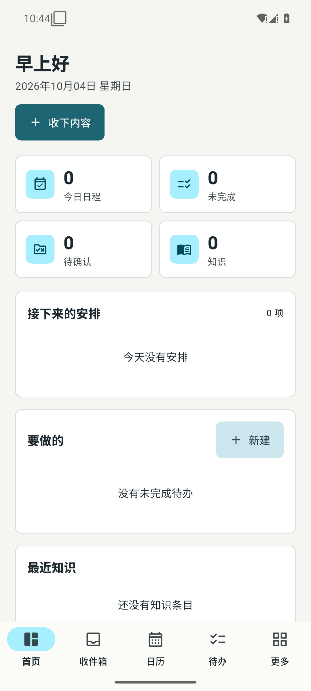
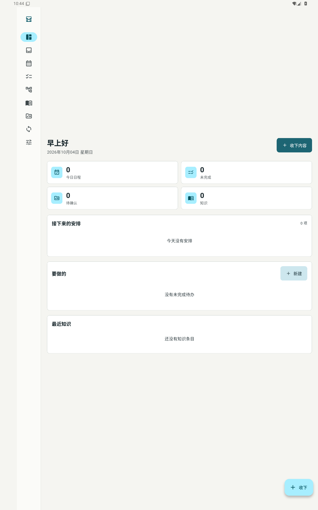

# 个人 AI 收件箱

[](https://github.com/YuanFangCH/personal-ai-inbox/actions/workflows/flutter.yml)
[](LICENSE)

一个本地优先的个人信息捕获、整理与提醒系统。Android 手机、Android 平板和 Windows 端各自运行独立 Flutter App，以 Markdown 为权威成果库，通过端内规则、云端模型和可替换同步接口完成闭环。

项目当前只服务单用户，但配置、密钥和数据边界按可公开源码的方式设计：API Key、OAuth 令牌、签名文件、本地 vault 和运行截图都不进入仓库。

## 下载与安装

首个预发布版本从 [GitHub Releases](https://github.com/YuanFangCH/personal-ai-inbox/releases) 下载：

- Android 7.0 及以上：安装通用 APK。
- Windows 11 x64：选择安装包或便携 ZIP。
- 发布页同时提供 `SHA256SUMS.txt`，下载后应校验文件哈希。

`v1.1.0` 是最新的预发布测试版。Android 使用 Debug 证书，Windows 未进行代码签名；安装系统可能显示未知来源或未知发布者提示。完整说明见 [v1.1.0 发行说明](docs/releases/v1.1.0.md)。

## 核心能力

- 本地优先：文本、分享内容和图片先在本端落盘，离线时捕获、编辑和查看不受影响。
- Markdown 主库：一个成果一个 `.md` 文件，SQLite 只保存索引、同步游标和幂等账本，删库后可重建。
- AI 对话：本地多会话、SSE 流式回复、停止与重试、会话级上下文隔离。
- 图片输入：相册、拍照、Android 图片分享、自动缩放和 EXIF 清理。
- 受控自动记录：模型只可请求新建高置信、非敏感、无日期歧义且未重复的成果，修改和删除永不自动执行。
- 行动与知识：内置事项、日历工作区、知识、确认队列和同步状态页面；日历统一承载日程、我的一天和待办，并提供事件/待办快速新建。
- 系统接入：Android 注册 `ACTION_SEND` 与 `ACTION_PROCESS_TEXT`，支持从其他 App 分享文本和图片。
- 多端形态：同一套 Flutter 代码适配手机、平板、Windows 和 Web 预览。

## 界面预览

| Android 手机 | Android 平板 |
|---|---|
|  |  |

## 架构

```text
Android / Windows / Web
  -> 端内捕获
  -> Markdown vault + SQLite 索引
  -> 规则引擎与受控模型工具调用
  -> 云模型 API（可选）
  -> SyncProvider（当前含端内沙箱实现）
```

- `Markdown` 是成果的权威存储。
- `SQLite` 只做索引、同步游标和幂等账本。
- AI 只生成候选，端内规则决定能否自动新建成果。
- 同步层通过 `SyncProvider` 抽象，OneDrive 等真实通道尚未接入。
- 会话、消息、工具审计和图片附件只保存在本端，不进入成果同步区。

详细设计见 [可执行方案](docs/personal-ai-inbox-executable-plan.md)、[同步协议](docs/sync-protocol.md)、[模型接入](docs/model-integration.md) 和 [ADR 索引](docs/adr/README.md)。

## 快速开始

前置环境：

- Flutter stable
- Dart 3.13.5 或兼容版本
- Android SDK，用于构建 Android App
- Visual Studio 2022 C++ 桌面工作负载和 ATL，用于构建 Windows App

```powershell
cd app
flutter pub get
flutter run
```

常用构建：

```powershell
flutter build apk --release
flutter build windows --release
flutter build web --release
```

## 模型配置

设置页支持 OpenAI 兼容配置：

- `Base URL`
- 模型名
- API Key
- 是否允许图片发送到云端

默认端点为 `https://api.deepseek.com`，默认模型为 `deepseek-flash`。API Key 只写入系统安全存储，不写入 Markdown、日志或 Git。

## 验证

```powershell
cd app
flutter analyze
flutter test --reporter expanded
flutter build web --release
```

仓库还包含 200 条跨端回归、100 条 Android UI、100 条双设备验收和 20 个大型综合场景。执行方式见 [app/README.md](app/README.md)。

Git hooks 安装与策略：

```powershell
powershell -ExecutionPolicy Bypass -File .\scripts\install-git-hooks.ps1
powershell -ExecutionPolicy Bypass -File .\scripts\test-git-policy.ps1
```

公开推送前审计：

```powershell
powershell -ExecutionPolicy Bypass -File .\scripts\scan-public-release.ps1
```

## 项目结构

```text
app/
  lib/core/      模型、Markdown 编解码和确定性解析
  lib/data/      本地存储、SQLite、同步引擎和配置
  lib/services/  模型、聊天、捕获和应用控制
  lib/ui/        Flutter 页面、主题和通用组件
  test/          单元、组件、矩阵和回归测试
  integration_test/
docs/            架构方案、协议、ADR、研究与测试报告
scripts/         构建、验收、Git 策略和公开发布审计
```

## 当前边界

- OneDrive OAuth、百度网盘归档和真实双向同步尚未完成，当前同步页使用端内沙箱 Provider。
- Android release APK 仍使用模板 debug 签名，正式分发前应配置独立签名。
- 本地通知、厂商后台策略、相机流程和第三方图片分享仍需更多真机验证。
- 图片在配置模型后默认允许出网；客户端只处理尺寸和 EXIF，不会自动判断图片内容是否敏感。

## 开源与安全

- 许可证：[MIT](LICENSE)
- 安全问题报告方式：[SECURITY.md](SECURITY.md)
- 贡献说明：[CONTRIBUTING.md](CONTRIBUTING.md)
- 不要提交 API Key、OAuth 令牌、签名密钥、环境文件、本地 vault、附件或包含敏感信息的截图。
- 若密钥曾进入 Git 历史，应先在提供商侧撤销或轮换，再清理历史；删除文件本身不能使已泄漏密钥失效。

## 许可证

Copyright (c) 2026 YuanFangCH

本项目采用 [MIT License](LICENSE)。
