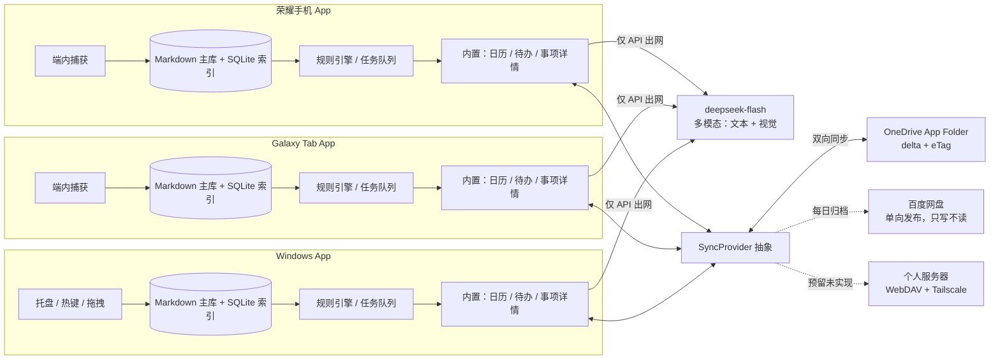

# 个人 AI 收件箱与提醒系统：可执行方案

> 版本：v2.4
> 日期：2026-10-07
> 目标环境：荣耀 Android 手机、三星 Galaxy Tab S7 FE、Windows 11、OneDrive、百度网盘、可选自有服务器（独立主机 + 公网 IP）
> 配套调研：
> - [收集入口与知识库](research/01-knowledge-capture.md)
> - [日历、提醒与跨端同步](research/02-calendar-reminders.md)
> - [AI、OCR 与自动化编排](research/03-ai-automation-ocr.md)

> **v2.0 关键变更**
> 1. 手机、平板、Windows 三端都做成独立 App，不再用 HTTP Shortcuts + PWA 拼装。
> 2. 三端各自拥有独立存储、独立运算与 AI 单元，断网也能完整工作。
> 3. 跨端只同步最终成果，不做实时同步，把带宽留给真正定稿的内容。

> **v2.1 追加要求**
> 1. 不做本地模型部署：OCR、分类、摘要、结构化全部通过 API 接入云端大模型；每端只保留自己的规则引擎、任务队列和 API 凭据。
> 2. 以 Markdown 文件为主：`.md` 文件是知识、待办和事项的权威存储，数据库只做索引、同步游标和幂等账本。
> 3. App 自带完整界面：日历、简略待办列表、事项详情（类似荣耀笔记的使用体验），不把核心交互外包给系统日历或第三方 App。

> **v2.2 关键变更（后端收口）**
> 1. 不建集中式后端服务：后端 = 每端 App 内的本地核心，跨端只通过云盘交换成果。
> 2. OneDrive 承担双向同步（App Folder + delta + eTag/If-Match + MSAL），百度网盘只做每日单向归档，个人服务器预留接口暂不实现。
> 3. 同步语义、冲突与删除、凭据存放、触发节奏全部定稿，细节见 [同步协议](sync-protocol.md)。

> **v2.3 关键变更（AI 对话）**
> 1. 收件箱改为本地多会话对话界面；每次冷启动创建新空白会话，历史会话可继续追问但上下文完全隔离。
> 2. 会话支持文本、剪贴板文本、相册、拍照和 Android 图片分享；每次只发送当前会话最近 20 条消息。
> 3. 模型可通过受约束工具自动新建高置信成果，不修改或删除已有成果；低置信和风险项进入待整理区，并保留 10 分钟撤销。
> 4. 会话与图片仅存本端、不参与同步；图片在配置模型后默认允许出网，设置页提供总开关。细节见 [ADR 0010](adr/0010-contextual-ai-conversation-and-guarded-auto-write.md)。

> **v2.4 关键变更（会话生命周期与确认入口）**
> 1. 冷启动和普通重进直接进入首页，不再自动创建或打开空白会话。
> 2. 点击“新对话”只打开未持久化的输入页，首次发送非空文字或图片后才创建会话。
> 3. 启动时清理没有消息的历史空会话；独立确认页并入收件箱，捕获确认和同步冲突在同一入口处理。细节见 [ADR 0013](adr/0013-lazy-conversation-creation-and-merged-confirmation.md)。

## 0. 版本变更对照

| 维度 | v1.0 | v2.0 |
|---|---|---|
| 客户端形态 | Android 用 HTTP Shortcuts，Windows 用 PWA | 三端各自独立 App，共享一套核心库 |
| 处理位置 | 服务端 OCR + LiteLLM 为主 | 端内 OCR / 规则 / 模型为主，服务器降级为可选 |
| 存储 | 服务端 PostgreSQL + vault 为唯一权威源 | 每端独立 SQLite + 本地 vault，互为副本 |
| 同步内容 | 日历走 CalDAV，其余以服务端为中心 | 只同步最终成果对象（知识卡片、事件、任务、提醒、审批） |
| 同步方式 | 准实时（CalDAV / Webhook） | 按需增量，手动 / 定时 WiFi / 充电批量 |
| 原始素材 | 上传服务端处理 | 默认留在本端，不出网 |
| 服务器角色 | 唯一大脑，宕机即瘫痪 | 可选中继、备份、冲突仲裁、云模型兜底 |

v2.1 在此基础上再收敛三点：

| 维度 | v2.0 设想 | v2.1 定稿 |
|---|---|---|
| AI 位置 | 端内量化小模型 + 可选云 API | 不部署本地模型，全部走云端大模型 API |
| 数据主形态 | SQLite + Markdown 并存 | Markdown 文件为主，数据库只做索引与账本 |
| 交互界面 | App 内视图 + 可选系统日历桥接 | App 自带日历、待办列表、事项详情三件套 |

v2.2 把后端与同步收口：

| 维度 | v2.1 | v2.2 定稿 |
|---|---|---|
| 后端形态 | 服务器可选，承担中继 / 备份 / 仲裁 | 无集中式后端；端内本地核心即后端 |
| 同步通道 | 局域网直连 + 可选中继 | OneDrive 双向同步；百度网盘每日单向归档 |
| 冲突与删除 | 规则未定 | 冲突留副本进确认队列；删除用 30 天墓碑 |
| 变更判定 | 未定 | 三项 hash 判单边修改，时钟只用于破平局 |
| 凭据 | 未定 | 每端独立 OAuth，令牌存系统安全存储，public client + PKCE |

## 1. 最终建议

这套系统不应做成“AI 直接操作日历”的黑盒，也不应做成“离开服务器就瘫痪”的瘦客户端。v2.2 的结构是：**三端对等、端内闭环、Markdown 为主、云盘同步成果**。

1. 手机、平板、Windows 三端都做成独立 App，自带日历、待办列表和事项详情，具备相同的捕获、查看和提醒能力。
2. 每一端都有自己的本地存储（以 Markdown 文件为主 + 索引数据库）和自己的规则引擎、任务队列、云模型接入配置，断网也能捕获和查看。
3. 捕获进来的原始内容先在端内落盘并立即返回；需要模型能力时，由本端 App 用自己的 API 凭据直接调用云端大模型，不在本地部署模型。
4. 云端大模型只负责生成结构化候选，不直接改日历、待办或笔记。
5. 规则引擎在端内校验日期、时区、重复键和置信度，再执行确定性的写入。
6. Markdown 文件是权威存储：知识卡片、事项详情、待办条目都先落成 `.md`；数据库只做索引、同步游标和幂等账本。
7. 跨端只同步最终成果：定稿的 Markdown、日历事件、待办和审批结论。原始截图、中间状态和实时输入不参与同步。
8. 同步按需触发（手动、定时、WiFi + 充电批量），不做实时同步，把带宽留给真正的成果。
9. 不建集中式后端；自有服务器只保留为未来的 `SyncProvider` 位置，当前不实现，三端完全靠本地核心 + 云盘运行。
10. 到点提醒由每端 App 自己的调度器负责，不依赖成果是否已同步到其他端，也不依赖系统日历或第三方 App 常开。

推荐默认组合（v2.2）：

```text
Android 手机 App / Galaxy Tab App / Windows App
  -> 端内捕获（分享菜单、剪贴板、拖拽、热键、文件夹监听）
  -> 端内 Markdown 主库（.md 文件）+ 索引数据库（SQLite），立即落盘并返回
  -> 端内规则引擎、任务队列、云模型接入配置
  -> 云端大模型：deepseek-flash（DeepSeek-V4.1-Flash，多模态，不部署本地模型）
       - 文本：分类、摘要、结构化
       - 视觉：截图 OCR、版面理解
       - 每端自己的 API Key；图片自动缩放、去 EXIF，并默认允许出网
  -> 端内 JSON Schema 校验与规则层
  -> 端内生成最终成果并写入 .md 与内置模块
       - 笔记：Markdown 卡片/长文，带 frontmatter 和来源引用
       - 日历：App 自带日历视图 + 事件
       - 待办：App 自带简略待办列表
       - 提醒：端内调度器
  -> 成果同步层（SyncProvider 抽象，只传定稿成果）
       - OneDrive：双向同步（App Folder + delta）
       - 百度网盘：每日单向归档
       - 触发方式：每 15 分钟 + 定稿 / 回前台 / 手动下拉
  -> 无集中式后端；个人服务器仅预留接口位置
```

三端 App 都是“完整节点”，不是遥控器；没有中心服务，云盘只是成果的交换媒介。

## 2. 要解决的核心问题

### 2.1 必须满足

- 手机、平板、Windows 三端都要有独立 App，而不是“一个网页 + 一个脚本”的拼装方案。
- 三端 App 都自带日历、简略待办列表和事项详情（类似荣耀笔记的使用体验），核心交互不外包给系统日历或第三方 App。
- 三端都能把任意文本、截图、链接或文件快速送入系统（分享菜单、剪贴板、拖拽、热键、文件夹监听）。
- 三端各自拥有独立的本地存储，且以 Markdown 文件为主：`.md` 是权威副本，数据库只是索引和账本；断网、服务器宕机时仍可捕获和查看。
- 三端各自拥有独立的规则引擎、任务队列和云模型接入配置；不部署本地模型，模型能力全部通过 API 调用云端大模型。
- 每端用自己的 API Key 独立出网，可配置不同厂商和模型，不强制三端共用同一个服务端账号。
- 跨端只同步最终成果（Markdown、知识卡片、日历事件、待办、提醒、审批结论），不同步原始素材、中间状态和实时输入。
- 同步按需触发，不做实时同步；默认只在 WiFi / 充电 / 手动触发时批量交换成果，节省带宽。
- 任一端离线期间的捕获和编辑可暂存本地，恢复连接后增量合并，不丢失、不阻塞。
- AI 自动判断内容属于知识、事项、待办、二者混合或无法判断。
- 事项能自动进入 App 自带日历或待办列表，并在三端同步成果后都看得到。
- 到点提醒在手机、平板和 Windows 上至少各有一条可靠路径，且不依赖其他端已同步。
- 知识能自动整理为 Markdown 报告，带来源、标签和可检索引用。
- 端内重启、云模型超时、同步失败时不能静默丢失原始内容或成果。
- 数据可备份、可迁移、可删除；不把唯一副本困在某个 RAG 产品或多个端的单点里。

### 2.2 第一版不做

- 不做多人协作、团队权限和多租户。
- 不在端内部署 OCR 模型或大模型，不追求离线 AI；模型能力统一走云端 API。
- 不做三端实时协同编辑和逐字同步，成果同步以分钟级、批量为目标。
- 不同步原始截图和附件全文，除非用户对某个成果显式开启“附带原图”。
- 不让 AI 自动修改或删除用户手工创建的日历项、待办和笔记。
- 图片默认允许上传到第三方模型；客户端自动缩放、重编码并去除 EXIF，用户需自行控制图片中的敏感内容。
- 不把百度网盘作为实时同步主链路。
- 不先做复杂知识图谱、手写识别和多模态 Agent 自主体。
- 不做多用户账号体系，也不做公开发布所需的审核材料；当前只服务一个用户，但代码按未来开源准备：配置外置、密钥不进仓库、不依赖个人专属服务。

## 3. 架构决策

| 层 | 默认选择 | 原因 | 备选 |
|---|---|---|---|
| 客户端形态 | 三端各自独立 App，共享一套核心库 | 满足“三端都是 App”的要求，逻辑复用、体验一致 | 单端原生各写一遍 |
| 客户端技术栈 | Flutter（Dart） | 两个 Android 端的分享接收、通知、后台任务插件最成熟；Windows 的托盘与热键也有现成方案 | .NET MAUI、Tauri、纯原生 |
| Android 入口 | App 内系统 Share Target | App 直接注册分享接收，捕获最可靠 | HTTP Shortcuts（降级备选） |
| Windows 入口 | 桌面 App（托盘常驻）+ 热键 + 拖拽 | 文本、截图、文件都能快速投递 | PWA、AutoHotkey |
| 平板入口 | 与手机同一 Android App，大屏适配 | 复用配置与核心，只替换 device_id | 单独平板版 |
| 端内存储 | Markdown vault 为主 + SQLite 索引（每端独立） | `.md` 可读可迁移，索引可重建，不依赖服务器 | 纯数据库存储 |
| 端内运算 | 规则引擎、任务队列、解析与格式化 | 确定性和离线部分留在端内，模型能力出网 | 全部在服务端处理 |
| 云模型接入 | 每端用自己的 API Key 直连云端大模型 | 不部署本地模型，模型可换、可分级 | 统一走自建网关 |
| 成果同步 | `SyncProvider` 抽象 + OneDrive 增量同步 | 只传定稿成果，不做实时同步，通道可替换 | Syncthing、Git、网盘客户端 |
| 端内编排 | App 内置任务队列与重试 | 三端独立闭环，离线可用 | 无（端内自足） |
| 云盘通道 | OneDrive 双向 + 百度网盘单向归档 | OneDrive 有 delta 与条件写入；百度网盘只适合留档 | 自建 WebDAV（预留，暂不实现） |
| 反向代理 / 组网 | 不需要 | 无集中式后端，三端只做出站 HTTPS | 自建 WebDAV over Tailscale（未来） |
| 服务端编排 | 不采用 | 编排在端内，云盘只承担文件交换 | n8n / Activepieces（已否决） |
| OCR | 云端多模态模型的视觉能力 | 不部署本地模型，截图直接送云端做 OCR + 版面理解 | 本地 PaddleOCR（不采用） |
| 模型边界 | 统一用 `deepseek-flash`（DeepSeek-V4.1-Flash，多模态） | 文本与截图走同一条链路，客户端只维护一个模型配置 | 多厂商切换（当前不需要） |
| 数据主形态 | Markdown 文件（`.md`）为权威存储 | 可读、可 diff、可 Git、可备份、可长期迁移 | Joplin、Obsidian 仅作编辑前台 |
| 索引数据库 | SQLite（FTS5 / sqlite-vec） | 只做索引、同步游标和幂等账本，可重建 | 服务端 PostgreSQL 可选汇聚 |
| 成果权威源 | 每端本地成果库互为副本 | 对等无主，任一端离线不影响其他端 | 服务端作为唯一权威源 |
| 内置界面 | App 自带日历 + 待办列表 + 事项详情 | 满足“荣耀笔记式”的使用体验，不依赖第三方 App | 桥接系统日历 / Tasks.org |
| 跨端镜像 | 默认不需要；可选 Nextcloud / CalDAV | App 自带日历和待办后，第三方镜像只在需要时启用 | Radicale、Baikal |
| 知识主库 | 每端本地 Markdown vault | `.md` 是唯一权威副本，数据库只做索引 | Joplin、Obsidian 仅作编辑前台 |
| 知识发布 | 本地静态站 / MkDocs Material（可选） | 静态、快、手机和电脑都能访问 | Nextcloud Files、GitBook |
| Android 提醒 | App 本地通知 + 前台服务 | 自建、可在无 GMS 设备使用，不依赖第三方 | ntfy |
| Windows 提醒 | 原生 Toast + 托盘 + 任务计划补发 | 不依赖浏览器常开，也覆盖睡眠唤醒后的补发 | Thunderbird、ntfy |
| 备份 | restic + rclone 到 OneDrive | 加密、可校验、可恢复；OneDrive 已有账号 | 本地 NAS、冷备硬盘 |

### 3.1 关键判断

- 三端 App 都要能“单机自洽”：只装一台设备也能捕获、编辑、查看、提醒。跨端同步是增强，不是前提。
- 不部署本地模型。每端 App 用自己的 API 凭据直连云端大模型；弱端不怕模型太大，只怕网络不稳，所以必须做超时、重试和离线排队。
- 没有中心服务可依赖，也没有中心服务可宕机；跨端一致性完全由云盘同步区、三项 hash 判定和冲突队列保证。
- 云端模型只能通过受约束工具请求新建成果；端内规则层验证置信度、敏感内容、日期和重复项后才允许自动写入，修改与删除永不自动执行。
- Markdown 是权威数据，数据库是可重建的索引。任何时候删掉 SQLite，都必须能从 `.md` 文件重建出笔记、待办和事项。
- 同步的是成果，不是素材。原始截图和附件默认留在捕获端，除非用户显式开启附带原图。
- 同步成功不等于提醒成功。每端都要有自己的提醒调度器，不依赖其他端是否已收到成果。
- 同一套 Markdown 格式、成果对象和同步协议是三端共享核心的关键；界面壳和模型厂商可以分化，数据契约不能分化。
- App 自带的日历、待办、事项详情是主入口；系统日历、Tasks.org、Thunderbird 只在用户主动需要时作为可选镜像。

### 3.2 三端独立架构（v2.2 核心）

三端一律按“完整节点”设计，任何一端都不是另一端的遥控器：

| 维度 | 荣耀手机 App | Galaxy Tab App | Windows App |
|---|---|---|---|
| 本地存储 | Markdown vault 为主 + SQLite 索引，配额 8-32 GB | 同手机，配额 8-32 GB | Markdown vault 为主 + SQLite 索引，按磁盘 |
| 运算单元 | 规则引擎、任务队列、解析与格式化 | 同手机 | 规则引擎、任务队列、批量格式化 |
| AI 单元 | 云端大模型 API 客户端（文本 + 视觉） | 同手机 | 云端大模型 API 客户端（文本 + 视觉） |
| 内置界面 | 日历 + 待办列表 + 事项详情 | 同手机，大屏双栏 / 三栏 | 日历 + 待办 + 事项详情，桌面布局 |
| 捕获入口 | 系统分享、拍照、剪贴板 | 系统分享、分屏、手写 / 键盘 | 托盘热键、拖拽、文件夹监听、剪贴板 |
| 提醒 | 本地通知 + 前台服务 | 本地通知 + 前台服务 | 原生 Toast + 托盘 + 任务计划补发 |
| 同步角色 | 对等节点 | 对等节点 | 对等节点 |

原则：

1. **端内闭环**：捕获、落盘、Markdown 编辑、待办管理、提醒都在端内完成；云模型只是被调用的能力，不是运行前提。
2. **对等无主**：不设唯一主节点；每端用自己的 `device_id` 产生成果，用稳定 `object_id` 做跨端合并。
3. **模型外置**：三端都不部署本地模型，统一通过 API 接入云端大模型；三端可以配置不同厂商、不同档位的模型。
4. **离线优先**：离线时捕获和 Markdown 编辑照常，需要模型的任务进本端队列，联网后自动补跑。
5. **共享核心**：三端 App 尽量共用一套核心库（Markdown 解析、成果格式、同步协议、规则引擎），只在界面壳和模型客户端上分化。

### 3.3 同步边界：只同步最终成果

**Markdown 是权威数据形态。** 每端的知识、待办和事项详情都以 `.md` 文件落在本地 vault 中，带 frontmatter 元数据；SQLite 只保存索引、同步游标、幂等键和提醒状态。同步时先比 `.md` 的 `id + revision + content_hash`，再按需交换文件。

“最终成果”有明确白名单，白名单之外一律不同步：

| 同步 | 不同步 |
|---|---|
| 事项 `matter`（含正文与关联） | 原始截图、原始附件全文 |
| 知识 `knowledge` | 捕获时的原始输入流 |
| 待办 `todo` | OCR 中间结果、模型原始响应 |
| 日历事件 `event` | 逐字输入、光标位置、实时编辑状态 |
| 成果的 tombstone（删除标记） | 提醒的运行时状态（由待办 / 事件字段派生） |
| 冲突副本 | 调试日志、埋点、临时文件、端内索引与缓存 |
| 自动记录生成的成果 `.md` | AI 会话、消息、工具调用审计和本端图片附件 |

成果对象统一契约（这是本地索引里的同步记录，不是 `.md` 文件内容；文件里不写 `content_hash`）：

```json
{
  "object_id": "kn_20261003_xxx",
  "object_type": "matter | todo | event | knowledge",
  "origin_device": "honor-phone",
  "revision": 3,
  "content_hash": "sha256:...",
  "updated_at": "2026-10-04T09:40:00+08:00",
  "deleted": false,
  "matter_id": null,
  "links": ["kn_20261004_abc"],
  "md_path": "vault/knowledge/kn_20261003_xxx.md",
  "schema_version": "1.1"
}
```

同步流程（OneDrive）：

```text
1. 用 /delta 游标拉取变更项（含新增、修改、删除）
2. 对每项用三项 hash 判定：接受远端 / 标记待上传 / 制造冲突副本
3. 上传时带 If-Match；412 则重判，410 则退回全量枚举
4. 更新 local_hash / last_synced_hash / remote_etag 与 deltaLink
5. 删除用墓碑传播，不靠“文件不存在”
```

带宽策略：

- 默认不做实时同步。触发方式：手动同步、定时（如每 15 分钟且仅在 WiFi）、成果定稿时、充电 + WiFi 批量。
- 只传差异对象，不重传未变化内容；对象用 SHA-256 去重。
- 原始素材同步是单独开关，默认关闭；确需跨端看原图时只传缩略图，或按需拉取。
- 同步只走 OneDrive 双向通道与百度网盘单向归档；不做局域网直连，不引入中继。

同步规则速览（完整协议见 [sync-protocol.md](sync-protocol.md)）：

- 双向同步只走 OneDrive App Folder；百度网盘每日推一个归档，只写不读。
- 本地目录即同步区镜像：`vault/matters|todos|calendar|knowledge/<id>.md`；`vault/drafts/`、`vault/raw/`、`vault/inbox/` 显式排除。
- 一个成果一个 `.md`，文件名用稳定 `id`，不用标题。
- 三项 hash 判定：远端没动就快进，本地没动就接受远端，两边都动才算冲突。
- 冲突保留副本进确认队列；删除写 30 天墓碑，不靠文件消失。
- 第二台设备登录同一 Microsoft 账号即接入，`device_id` 自动生成，无配对码。
- 失败指数退避（1 / 5 / 15 / 60 分钟，上限 6 次或 24 小时），单条失败不阻塞其他成果；令牌失效暂停并提示重登。
- 每条成果带同步状态徽标，另有同步总览页展示最后同步时间、失败重试和冲突队列。

### 3.4 行动域、知识域与关联

系统分成两个域，中间靠显式关联连接：

| 域 | 成员 | 存放 | 关系表达 |
|---|---|---|---|
| 行动域 | `matter` 事项、`todo` 待办、`event` 日历事件 | `vault/matters/`、`vault/todos/`、`vault/calendar/` | 待办和事件用 `matter: <id>` 声明所属事项；事项不列子项 |
| 知识域 | `knowledge` 知识 | `vault/knowledge/` | 与事项或其他知识用 `links: [<id>]` 关联 |

规则：

- `matter` 可以为空：允许“买牛奶”这类不属于任何事项的独立待办与事件，在 App 里归入默认收件箱。
- 关联单边存储：只在创建关系的那一侧写一次；反向引用（这件事下面有哪些待办、这条知识被哪些事项引用）由本地索引派生，不写进文件、不参与同步。
- 行动域的强关联靠 `matter` 字段加聚合视图表达，不靠目录嵌套。文件永远按类型平铺，否则“换归属”就要移动文件，而移动在云盘同步里会被误判成一删一增。
- 待办不嵌套：`todo` 不指向 `todo`。需要多个行动时建一个 `matter` 来装；待办正文里可以用 Markdown 复选框写清单，但不进数据模型。
- 关联改动走整文件冲突规则：两端同时改同一成果的关联，产生冲突副本进确认队列，不做并集合并（并集会把已删除的关联救回来）。
- 不做自动连接：没有 embedding、没有向量表、没有相似度推荐，关系由用户手动建立。

## 4. 推荐部署形态

### 4.1 服务拓扑



### 4.2 云盘通道

没有集中式后端服务。三端各自出站访问云盘，云盘只承担成果文件交换，不参与处理。

| 通道 | 角色 | 能力依据 | 状态 |
|---|---|---|---|
| OneDrive（App Folder） | 双向同步主通道 | `/delta` 提供含删除的增量变更；`eTag` + `If-Match` 支持条件写入；MSAL 覆盖 Android 与 .NET | 采用 |
| 百度网盘 | 单向发布 / 留档 | 有 OAuth 与专属目录，但无文件级 delta、删除需全量比对、未审核应用配额受限 | 采用（每日一个归档） |
| 个人服务器（独立主机 + 公网 IP） | 未来可替换通道 | WebDAV + RFC 6578 + Tailscale 最贴近目录同步 | 预留，不实现 |

原 v1.0 / v2.x 中的服务端组件（Caddy、n8n、PostgreSQL、Nextcloud、LiteLLM、OCR 服务等）不采用，详见 [ADR 0001](adr/0001-cloud-drive-sync-no-custom-backend.md)。

### 4.3 资源基线

- 三端 App：手机 / 平板至少 8 GB 本地配额，Windows 至少 20 GB 本地配额。
- 端内只跑规则引擎、任务队列、Markdown 解析和界面渲染，不需要 GPU；三端都不部署 OCR 或大模型。
- 云盘：OneDrive 免费额度通常足够放 `.md`；百度网盘每日归档只占很小空间。
- 模型成本与速率：按端配置 API Key 和额度；截图走视觉模型时优先压缩、裁剪，控制 token 消耗。
- 网络不稳时，云端调用要能排队和重试；离线只影响模型能力，不影响捕获、Markdown 编辑和查看。

## 5. 数据流和成果契约

### 5.1 端内处理与成果同步流程

```text
端内（离线可用）：
1. App 收到文本 / 图片 / 链接 / 文件，生成 event_id
2. 立即写入本地账本，原始文件写入本地 raw 目录，计算 SHA-256
3. 立即返回“已收下”，不等待云模型
4. 需要模型能力时，本端 App 用自己的 API Key 调用云端大模型
     - 文本：分类、摘要、结构化
     - 截图 / 文件：视觉模型做 OCR + 版面理解
5. JSON Schema 校验；失败一次自动修复，再失败进入本地人工队列
6. 规则层生成 matter / todo / event / knowledge 候选
7. 写入本地 Markdown 主库，并更新 SQLite 索引、内置日历 / 待办和提醒表
8. 生成最终成果对象，带上 object_id、revision、content_hash

跨端同步（按需触发）：
9. 两端交换成果 manifest，算出缺失 / 更新对象
10. 只拉取成果对象，打包压缩传输
11. 按 object_id 合并，冲突进确认队列
12. 同步结果写本端账本；删除用 tombstone 传播
```

### 5.2 捕获记录字段（端内）

以下字段是每端 App 的本地捕获记录格式；跨端同步时传的是 3.3 节的成果对象，不是这里。

```json
{
  "schema_version": "1.1",
  "event_id": "uuid-v4",
  "device_id": "honor-phone",
  "captured_at": "2026-10-03T18:00:00+08:00",
  "timezone": "Asia/Hong_Kong",
  "source_type": "text | image | url | file",
  "text": "明天下午三点提醒我交材料",
  "files": [],
  "client_meta": {
    "app": "wechat",
    "locale": "zh-CN"
  }
}
```

同步不引入自定义签名头：OneDrive 走 MSAL 的 OAuth 令牌，百度网盘走开放平台 OAuth。令牌、密钥都不放在 URL、查询参数或文件名中。

### 5.3 AI 分类输出

端内调用云端大模型后拿到的输出契约；它的结果经端内规则验证，只有满足条件的全新成果才允许自动写入，修改与删除必须人工处理。

```json
{
  "intent": "knowledge | event | task | mixed | reference | unknown",
  "title": "交材料",
  "summary": "需要在明天下午三点前提交材料。",
  "confidence": 0.94,
  "facts": {
    "entities": [],
    "dates": ["2026-10-04T15:00:00+08:00"],
    "amounts": [],
    "action_items": ["提交材料"]
  },
  "knowledge": {
    "topic": "学习/工作",
    "tags": ["材料", "截止提醒"],
    "key_points": [],
    "open_questions": []
  },
  "schedule": {
    "kind": "event | task | none",
    "title": "交材料",
    "start": "2026-10-04T15:00:00+08:00",
    "end": null,
    "due": null,
    "all_day": false,
    "timezone": "Asia/Hong_Kong",
    "recurrence": null,
    "reminder_minutes": [30, 0]
  },
  "needs_review": false,
  "review_reason": null
}
```

### 5.4 必需数据库表

每端本地以 Markdown vault 为权威存储，下列 SQLite 表只是索引、账本和运行状态，必须能从 `.md` 重建。三端不共享数据库，只通过同步区交换成果。

Markdown 主库：

- `vault/matters/`：事项正文（要求、背景、过程记录），一文件一条。
- `vault/knowledge/`：知识卡片与报告。
- `vault/todos/`：待办，frontmatter 记录状态、截止时间与所属事项。
- `vault/calendar/`：日历事件，frontmatter 记录起止时间与所属事项，可导出 `.ics`。
- `vault/inbox/`：尚未归类的捕获内容，不参与同步。

端内索引与账本：

- `events`：幂等事件、设备、原始来源、状态。
- `raw_assets`：文件路径、hash、MIME、大小、保留周期。
- `ocr_results`：OCR 文本、结构化版面、引擎和版本。
- `classifications`：模型输出、prompt 版本、schema hash、置信度。
- `actions`：知识、日历、任务、通知等待执行动作及其幂等键。
- `action_attempts`：重试次数、错误、下一次执行时间。
- `knowledge_docs`：Markdown 路径、canonical key、来源引用。
- `reminders`：提醒时间、通道、状态和去重键。
- `review_queue`：人工确认、修改和审批记录。
- `notification_outbox`：待发送通知，防止端内重启丢消息。

成果与同步：

- `objects`：成果对象索引，含 `object_id`、`object_type`、`revision`、`content_hash`、`md_path`、`matter_id`、`deleted`。
- `links`：显式关联，含 `from_id`、`to_id`；从文件 `links` 字段解析而来，权威副本仍在 `.md`。
- `matter_children`：由 `matter` 字段派生的聚合视图，可随时重建。
- `sync_peers`：已知对端、最后同步游标、最后成功时间。
- `sync_outbox` / `sync_inbox`：待发送 / 已接收的成果对象与冲突记录。
- `device_identity`：本端 `device_id`、密钥、成果签名。
- `calendar_links`：成果对象 ID、日历 UID、ETag、创建 / 更新时间。

## 6. 三端 App 形态与使用方式

三端共享同一套核心能力（捕获、端内处理、成果库、同步、提醒），只在界面壳和模型客户端上分化。

### 6.1 三端共同能力

- 捕获：文本、截图、链接、文件；支持分享菜单 / 剪贴板 / 拖拽 / 热键 / 文件夹监听。
- 端内处理：落盘 -> 调用云端大模型 -> 结构化 -> 规则校验 -> 生成成果。
- Markdown 主库：所有知识、事项详情和待办以 `.md` 落盘，带 frontmatter 元数据。
- 三大内置模块：日历、简略待办列表、事项详情（长文 / 图文笔记）。
- 同步：成果 manifest 交换 + 增量拉取，默认不实时。
- 提醒：端内调度，不依赖服务器或第三方客户端常开。
- 查看与编辑：三端都能浏览和编辑本地成果；联网后自动看到其他端的定稿成果。

### 6.2 荣耀手机 App

- 注册系统 Share Target，从任意 App 分享文本、图片或链接进来。
- 端内跑规则引擎、任务队列和内置三件套；截图和文本通过云端大模型 API 处理。
- Markdown vault 为主库 + SQLite 索引；断网时正常捕获、编辑和查看。
- 界面参考荣耀笔记的使用习惯：随手记、分类、置顶、待办勾选。
- 提醒走本地通知 + 前台服务，处理 MagicOS 的电池优化与自启动限制。
- 同步默认只在 WiFi、充电或手动时触发。

### 6.3 三星 Galaxy Tab S7 FE App

- 同一套 Android App，复用手机端配置，仅替换 `device_id`。
- 利用大屏做双栏 / 三栏：左侧日历或待办，右侧事项详情。
- 适合批量确认、知识整理和长文编辑；其余与手机一致。
- 端内提醒与本地库独立，不依赖手机在线。

### 6.4 Windows 11 App

- 托盘常驻 App：全局热键、剪贴板、拖拽、文件夹监听。
- 桌面布局支持日历月视图、待办列表和 Markdown 编辑；模型能力同样走云端 API。
- 原生 Toast + 托盘提醒，任务计划程序在登录 / 唤醒后补发。
- 可选承担百度网盘每日归档任务，减少其他端出网。

### 6.5 事项详情与笔记（Markdown）

- 每端本地 `vault/` 是 Markdown 主库，可独立阅读和编辑。
- 事项详情支持长文、图片、清单、代码块等 Markdown 常规能力；交互对齐荣耀笔记的“随手记 + 分类整理”体验。
- 知识卡片、日报周报都以 `.md` 生成，数据库里的索引可随时重建。
- 需要发布时由任一端本地生成 MkDocs 静态站。
- 需要离线编辑时，可用 Obsidian 等编辑器打开本地目录；不要让编辑器成为唯一副本。
- 每篇报告保留 `source_event_ids`、原始文件 hash、OCR 工具版本和模型版本。

### 6.6 日历、待办与提醒

- App 自带日历视图、简略待办列表和事项详情三件套；本地 Markdown 为主库，SQLite 提供快速查询。
- 日历支持月 / 周 / 日视图，事件与 `.md` 双向对应，可导出 `.ics`。
- 待办列表只展示标题、截止时间和状态，点击进入事项详情；复杂信息留在 `.md`。
- 提醒由每端本地调度器负责，不依赖某项成果是否已同步到其他端。
- 系统日历、Tasks.org、Thunderbird 只在用户主动需要时作为可选镜像，不是前提。

## 7. 知识处理规则

### 7.1 知识卡片

每条知识先形成一个原子卡片：

```markdown
---
id: kn_20261003_xxx
kind: knowledge
title: 某个主题
created_at: 2026-10-03T18:00:00+08:00
origin_device: honor-phone
tags: [tag1, tag2]
links: [mt_20261004_yyy]
source_event_ids: [evt_xxx]
source_hashes: [sha256:xxx]
status: draft | reviewed | canonical
---

## TL;DR

## 关键要点

## 原理或背景

## 应用场景

## 边界、反例和待验证

## 来源
```

`kind` 取 `matter | todo | event | knowledge` 之一。只有 `status: canonical` 的卡片参与跨端同步；`draft` 默认留在本端。`.md` 文件是权威副本，SQLite 里的行只是索引，删掉可以重建。

### 7.2 去重

按以下顺序去重：

1. `event_id` 唯一约束，防止重复捕获。
2. 文件 SHA-256 + MIME + 文件大小，防止同一截图重复处理。
3. 规范化 OCR 文本 hash 或 SimHash，发现近似重复。
4. embedding 相似度只产生“可能重复”候选，不自动删除。
5. 合并知识时保留所有来源引用，并记录合并原因。
6. 跨端合并按 `object_id` 做，重复成果只保留一份，来源端信息合并到同一条目。

### 7.3 报告

- 即时：每条知识生成一张卡片。
- 每日：21:30 生成当天收件箱摘要、未分类事项、即将到期任务。
- 每周：周日晚上按主题聚类，生成主题报告、重复问题和待办回看。
- 报告用 Jinja2 和结构化事实渲染，LLM 只生成受约束的摘要和解释。
- 引用统一写成 `[S1](../sources/evt_xxx#block-12)`，不允许只写“根据资料”。

## 8. 事项与提醒规则

### 8.1 分流

| 内容 | 默认动作 |
|---|---|
| 明确日期、时间、标题 | 在 App 自带日历创建事件，并生成对应 `.md` |
| 只有截止日期 | 在 App 待办列表创建待办（`.md` + 索引） |
| 无日期任务 | 放入 App 收件箱，不直接上日历 |
| 相对日期，如“明天下午三点” | 按捕获时刻和 `Asia/Hong_Kong` 解释 |
| 重复事项 | 首次进入确认队列；确认后写入基础 RRULE（每天 / 每周 / 每月 + 结束条件），不做例外与农历 |
| 修改或删除已有事项 | 必须确认，只允许修改系统创建的项 |
| 低置信度、日期歧义、过去日期 | 进入待确认队列 |
| 敏感内容 | 默认私有处理，不外发，除非明确选择云端模型 |

### 8.2 自动写入策略

建议用两阶段：

- 第 1-2 周：所有日历动作先进入收件箱确认区，用真实样本校准 prompt 和规则。
- 校准后：高置信、明确日期的新增事项自动写入本端专用日历；修改、删除、重复和敏感事项继续确认。

自动写入仍满足“懒”的需求，同时通过专用日历、稳定 UID 和撤销通知把风险控制在可逆范围。

### 8.3 提醒通道

每个事项至少有两条提醒路径：

1. 本端 App 内提醒调度：手机 / 平板用本地通知，Windows 用 Toast + 托盘。
2. 可选兜底提醒：导出 `.ics` 后由系统日历的 `VALARM` 触发，或经 ntfy / Email / Telegram 兜底。

默认提醒策略：

- 有具体开始时间：提前 30 分钟和开始时提醒。
- 只有截止日期：本地 09:00 和截止前 2 小时提醒。
- 无日期任务：每日摘要中提醒，不冒充定时事项。
- 距离现在不足 24 小时的新事件：创建后立即推送确认，防止成果同步延迟。
- 电脑关机或睡眠：下次登录 / 唤醒后补发标记为“已错过 / 补发”的通知。

## 9. 网络与安全

### 9.1 网络与出站边界

三端只做出站连接，不暴露任何入站端口：

1. OneDrive：Microsoft Graph HTTPS，双向同步。
2. 百度网盘：开放平台 HTTPS，每日单向归档。
3. 云端大模型：各厂商 HTTPS API。
4. 个人服务器：当前不实现；将来若启用，走 Tailscale 私网 + WebDAV，不直接暴露公网 IP。

因为不建集中式服务，v1.0 里的公网 IPv6、Caddy、Cloudflare Tunnel、双栈前门都不再是必需项；域名和证书只在未来启用个人服务器时才需要。

### 9.2 安全基线

- 每端独立 OAuth，令牌存系统安全存储（Android Keystore、Windows Credential Manager + DPAPI）。
- 应用注册为 public client + PKCE，App 内不放 client secret。
- 云模型 API Key 同样按端存放，使用系统密钥库，不写进代码或 Git。
- 成果对象在云盘里默认可读（Markdown 需要人可读）；需要更强隐私时再启用端到端加密，那是独立的一步。
- 人工确认使用一次性、高熵 token；过期即失效。
- 对外发送的通知使用中性标题，正文默认不包含地点、参会人和敏感内容。
- 云端模型默认只接收必要文本片段；图片默认允许在配置模型后出网，客户端自动缩放、重编码并去除 EXIF，但用户仍需自行检查图片中的敏感内容（见 ADR 0010）。
- 原始素材只在本端保留 30 天，到期自动删除，不参与同步。
- 每月至少跑一次脱敏、令牌和恢复检查。

## 10. 备份与恢复

### 10.1 数据分级

| 数据 | 备份频率 | 目标 |
|---|---|---|
| 每端 SQLite 成果账本 | 每日 | 本地加密快照 + OneDrive |
| 每端 `vault/` Markdown | 每日或每次变更 | 本地快照 + OneDrive；可选 Git 版本化 |
| 成果对象包 | 每日 | restic 去重备份 + OneDrive |
| 原始截图和附件 | 按需 | 默认留本端；需要时 restic 加密备份 |
| 客户端核心库、schema、prompt | 每次变更 | Git 私有仓库 |
| 模型和 OCR 版本清单 | 每次升级 | Git 锁文件 |

### 10.2 备份原则

- 使用 `restic` 加密备份，`rclone` 把快照送到 OneDrive。
- 百度网盘作为每日单向归档的第二份留档；它不参与双向同步，也不作为恢复的唯一来源。
- 每季度在空目录或临时机器执行一次完整恢复演练。
- 备份成功通知与备份内容分开；不要只看“脚本无报错”。

## 11. 分阶段执行计划

每个阶段完成后必须通过验收门槛，才进入下一阶段。

### 阶段 0：环境和决策门，0.5-1 天

任务：

1. 记录三端硬件：CPU、内存、磁盘、系统版本。
2. 选定客户端技术栈与共享核心边界（Markdown 格式、成果对象、同步协议、规则引擎）。
3. 选定云端模型厂商与每端 API Key 策略（文本 + 视觉）。
4. 确认同步通道：OneDrive 双向同步 + 百度网盘每日单向归档。
5. 确认不搭建集中式服务；个人服务器仅作为未实现的 `SyncProvider` 预留。
6. 确定成果对象白名单和不同步边界。

验收门槛：

```text
[ ] 三端都能编译运行一个空壳 App
[ ] 三端本地 SQLite 可读写，重启后数据仍在
[ ] 已明确哪些对象参与同步、哪些永不参与
[ ] 已确认各端可接受的最小模型与推理时延
```

### 阶段 1：三端 App 骨架与本地存储，2-3 天

任务：

1. 建立共享核心库（Markdown 解析、对象模型、成果格式、同步协议、规则引擎）。
2. 三端壳：Android 分享接收、平板大屏布局、Windows 托盘 + 热键。
3. 每端本地 Markdown vault 目录 + SQLite 索引 schema。
4. 三大内置模块的最小界面：日历、简略待办列表、事项详情。
5. 本地捕获、查看、编辑、失败重试的最小闭环。
6. 端内时区统一为 `Asia/Hong_Kong`，生成稳定 `device_id`。

验收门槛：

```text
[ ] 三端各自离线捕获一条文本并本地查看
[ ] 三端都能新建一条 Markdown 事项，并在日历 / 待办 / 详情三个视图看到
[ ] 删除 SQLite 索引后能从 .md 重建
[ ] 三端卸载重装后本地成果可恢复（从本地备份）
[ ] 每端 device_id 唯一且稳定
[ ] 断网状态下捕获不阻塞、不报错
```

### 阶段 2：端内捕获与成果生成，2-3 天

任务：

1. 端内事件写入 + 原始资产 hash。
2. 云模型客户端：文本分类、视觉 OCR、结构化输出。
3. 端内规则层与最小分类。
4. 生成 `matter` / `todo` / `event` / `knowledge` 四类成果对象。
5. 端内 JSON Schema 校验与失败队列。
6. 每端都能独立产出一份可同步的成果。

验收门槛：

```text
[ ] 分享“明天下午三点交材料”在端内生成次日 15:00 事件和对应 .md
[ ] 截图经云端视觉模型返回结构化候选并写入 .md
[ ] 端内重复捕获同一内容不重复生成对象
[ ] 云端 API 超时后任务进队列，恢复后自动补跑
[ ] 成果对象包含稳定 object_id、revision、content_hash 和 md_path
```

### 阶段 3：云端模型接入与结构化，2-3 天

任务：

1. 定义云模型客户端：文本模型 + 视觉模型，OpenAI 兼容协议优先。
2. 每端配置独立 API Key、超时、重试、退避和并发上限。
3. 定义分类 JSON Schema 和提示词版本。
4. 云端 OCR -> 结构化 -> schema 校验 -> 修复重试。
5. 保存模型名、prompt 版本、schema hash 和耗时。
6. 准备 30-50 个真实样本做回归集。

验收门槛：

```text
[ ] 三种端都能对中文截图调用云端视觉模型并生成结构化候选
[ ] schema 通过率 > 99%（回归集 30-50 样本）
[ ] 日期 / 金额抽错进入确认，不直接写入
[ ] 云端不可用时捕获、Markdown 编辑和查看不受影响
[ ] 敏感样本出网前有明确提示与脱敏选项
```

### 阶段 4：云盘同步层，2-3 天

任务：

1. 定义 `SyncProvider` 接口：列变更、上传、下载、删除、标记冲突。
2. 实现 OneDrive provider：App Folder、MSAL 登录、`/delta` 游标、`If-Match` 条件写入。
3. 实现三项 hash 判定与 last-synced-hash 账本。
4. 冲突副本与 30 天墓碑。
5. 触发与调度：15 分钟周期 + 定稿 / 回前台 / 手动下拉；Android 用 WorkManager，Windows 用 Task Scheduler。
6. 失败退避与重试，令牌失效暂停并提示重登。
7. 同步状态徽标与总览页。
8. 实现百度网盘每日单向归档。

验收门槛：

```text
[ ] 手机产生的成果在平板和 Windows 上可见
[ ] 同步只传定稿成果，原始截图不出端
[ ] 同一成果重复同步不产生副本
[ ] 两端同时改同一成果会产生冲突副本并进入确认队列
[ ] 删除在 30 天内以墓碑传播，而不是文件消失
[ ] 令牌失效时同步暂停并提示，其他功能不受影响
[ ] 单条成果失败不阻塞其余成果
```

### 阶段 5：知识报告与检索，1-2 天

任务：

1. 定义 Markdown frontmatter 和目录结构。
2. 原子知识卡片写入。
3. Jinja2 日报和周报。
4. 端内本地 FTS 或向量索引。
5. 引用 `source_event_ids` 和 OCR block。

验收门槛：

```text
[ ] 新知识 1 分钟内可被本端检索
[ ] 报告事实可回溯到原始事件或 OCR block
[ ] 删除索引后可重建
[ ] 三端同步后能看到同一篇报告
```

### 阶段 6：提醒、确认与跨端闭环，2 天

任务：

1. 每端 `reminders` 表与本地调度器。
2. 端内通知（Android 前台服务、Windows Toast / 托盘）。
3. 收件箱内的确认区 / 审批与撤销窗口。
4. 失败队列与每日摘要。
5. 可选 ntfy / Telegram / Email 兜底。

验收门槛：

```text
[ ] 手机锁屏、勿扰、重启后都能提醒
[ ] Windows 登录、唤醒、重启后补发
[ ] 提醒不依赖成果是否已同步
[ ] 确认 token 不能重复使用
[ ] 任何失败可定位 object_id 与动作
```

### 阶段 7：备份、安全与上线，1-2 天

任务：

1. 每端本地加密备份 + OneDrive 版本历史；百度网盘每日归档。
2. 每端 OAuth 令牌与模型 Key 的安全存储检查。
3. 固定模型版本、prompt 版本与 frontmatter schema 版本。
4. 恢复演练：从 OneDrive 同步区 + 本地备份重建某端。
5. 三端安装清单与首次接入步骤。

验收门槛：

```text
[ ] 空机器登录 OneDrive 后能拉回全部定稿成果
[ ] 云盘只有成果与墓碑，没有原始素材
[ ] 令牌与模型 Key 不在代码、配置或 Git 中
[ ] 三端 30 分钟内完成安装与接入
```

预计总工期：11-18 个专注工作日。若只做“三端各自 App + Markdown 主库 + OneDrive 双向同步 + 一个云模型”，不碰百度网盘归档、镜像日历和报告发布，5-8 天可完成可用 MVP。

## 12. 验收测试矩阵

| 编号 | 场景 | 预期 |
|---|---|---|
| T1 | 分享“明天下午三点交材料” | 创建次日 15:00 事件成果，提前 30 分钟提醒 |
| T2 | 分享一篇知识文章 | 生成 Markdown 卡片和来源引用 |
| T3 | 分享“下周找时间看房子” | 进入确认队列，不擅自选择日期 |
| T4 | 分享同一张截图三次 | 只生成一个知识条目和一个事项 |
| T5 | 云端模型超时 / 断网 | 原始内容保留，任务排队，恢复后自动补跑 |
| T6 | 成果同步延迟 | 本端提醒仍能在关键时间触发 |
| T7 | Windows 睡眠跨过提醒 | 唤醒后补发并标记“已错过 / 补发” |
| T8 | 蜂窝网络下同步 | 通过 OneDrive HTTPS 正常同步，无需任何公网入口 |
| T9 | 错误识别日期或金额 | 低置信度进入确认，不自动写入 |
| T10 | 备份恢复 | 空机器恢复后数据、报告、日历均可重建 |
| T11 | 三端断网各自使用 | 捕获、Markdown 编辑、日历 / 待办查看都正常，不丢数据；云任务排队 |
| T12 | 不部署任何服务端 | OneDrive 双向同步与百度网盘归档都正常 |
| T13 | 同步前后对比流量 | 只传成果对象，原始截图不出端（默认） |
| T14 | 手机与平板同时改同一事件 | 进入确认队列，不静默覆盖 |
| T15 | 云端不可用 | 捕获、编辑与查看正常，模型任务延后 |
| T16 | 删除本地 SQLite 索引 | 能从 `.md` 文件重建笔记、待办和事项 |
| T17 | 新建事项 | 生成 `matter` 文件，聚合视图中能看到它下面的待办与事件 |
| T18 | 查看运行环境 | 三端均无本地模型进程，AI 调用只走云端 API |
| T19 | 两端同时修改同一成果 | 生成冲突副本并进入确认队列，不静默覆盖 |
| T20 | 删除一条成果 | 30 天内以墓碑传播，其他端同步后消失 |
| T21 | OneDrive delta token 失效（410） | 自动退回全量同步，不丢变更 |
| T22 | OAuth 令牌过期 | 同步暂停并提示重登，本地功能不受影响 |
| T23 | 单条成果上传失败 | 指数退避重试，其余成果照常同步 |
| T24 | 第二台设备首次登录 | 自动定位同一 App Folder 并拉回全部定稿成果 |
| T25 | 查看百度网盘 | 只有每日归档，没有原始素材，也不被其他端回读 |
| T26 | 新建事项并挂待办与事件 | 三个文件各自独立，聚合视图中归到同一事项下 |
| T27 | 给事项关联一条知识 | 只在事项一侧写 `links`，反向引用由索引显示，未新增文件 |
| T28 | 待办不挂任何事项 | 正常创建与提醒，出现在默认收件箱 |
| T29 | 两端分别给同一成果加不同关联 | 产生冲突副本进确认队列，不做静默并集 |
| T30 | 创建“每周三 19:00”的重复事件 | 写入基础 RRULE，三端同步后提醒时间一致 |
| T31 | 尝试给待办挂子待办 | 数据模型拒绝；需要多个行动时引导建事项 |
| T32 | 把截图发给云端模型 | 默认允许出网，客户端自动缩放、去 EXIF；用户自行确认图片内容 |

## 13. 备选方案

### 13.1 严格开源许可版

- 同步改用自建 WebDAV（需支持 RFC 6578）+ Tailscale，替代 OneDrive。
- 模型改用可自托管的开源模型服务（此时需要 GPU），或退化为纯规则引擎。
- 其余保持 Markdown + 端内核心 + `SyncProvider` 抽象。
- 代价：要自己维护服务器、证书与备份，并放弃 OneDrive 的 delta 便利。

### 13.2 最快上线版

- 三端先做最小 App：捕获 + Markdown 主库 + 内置日历 / 待办 + OneDrive 双向同步。
- 云模型只接一个文本模型和一个视觉模型，先跑通分类和 OCR。
- 暂不做百度网盘归档、报告发布和日历桥接。
- 代价：集成少，但最快验证“三端独立 + Markdown 为主 + 只同步成果”的主干。

### 13.3 多厂商模型版（当前不采用）

- 文本与视觉分别接不同厂商，按成本、隐私和质量路由。
- 代价：多套提示词与结构校验、多套限额与密钥管理；当前统一用 `deepseek-flash`，不做这一分支。

### 13.4 已有 Microsoft 365 版

- 日历使用 Microsoft Graph，Windows 用 Outlook 原生提醒。
- 适合工作用户，但要处理 OAuth、订阅续订、429 和租户策略。

## 14. 设计状态

全部设计已定稿，无待确认项。

已定：客户端用 Flutter，当前个人自用但按未来开源准备；模型走 OpenAI 兼容配置，默认 `deepseek-flash`，内置能力表允许用户覆盖，三端共用一把 Key 并以 `user_id` 区分设备，未配 Key 时 AI 功能禁用，细节见 [模型接入](model-integration.md)；内置日历支持基础重复，不做例外 / 农历 / ICS 订阅；待办不嵌套，聚合层只有事项；文本和图片可出网，图片自动缩放、去 EXIF，并按 ADR 0010 默认允许发送；知识不发布静态站，App 内查看并可按需导出 Markdown。

默认开工方案：Flutter 三端 + Markdown 主库 + 行动域（事项 / 待办 / 事件）+ 知识域 + OneDrive 双向同步 + 百度网盘每日归档 + 默认 `deepseek-flash`（OpenAI 兼容可替换）。

## 15. 参考结论来源

本方案不是单一项目的简单推荐，而是对以下一手资料和调研报告的收敛。注意：`docs/research/` 下的三份调研报告撰写于 v1.0 的服务器中心架构，其调研事实仍然有效，但结论以本 v2.2 方案为准。

- W3C Web Share Target、Chrome Web Share Target：验证 PWA / Web 侧文本和文件接收能力。
- HTTP Shortcuts 官方文档：验证 Android 分享、脚本、UUID、HMAC 和文件上传能力（现降级为备选）。
- Android Share Target、Flutter / .NET MAUI / Tauri 官方文档：验证三端 App 与系统分享接收能力。
- RFC 4791、RFC 5545、RFC 6638：CalDAV、iCalendar、VTODO 和调度基础。
- DAVx5、Tasks.org、Etar、Thunderbird 官方文档：验证 Android / Windows 同步与提醒边界。
- Nextcloud、Radicale、Baikal 官方文档：验证可选的日历 / 任务镜像选型（当前不采用）。
- n8n、Activepieces、Windmill、Node-RED 官方文档：验证服务端编排能力（已否决，编排在端内）。
- DeepSeek API 官方文档：验证 `deepseek-flash` 的模型名、图像输入、JSON Output、价格时段、并发与 `user_id` 隔离（细节见 [模型接入](model-integration.md)）。
- 其它云端多模态模型（OpenAI、Gemini、Claude、通义千问等）官方文档：作为开放接入的备选端点参考。
- LiteLLM 官方文档：验证可选的多厂商网关、结构化输出、重试和路由（当前不采用，端内直连各厂商）。
- Markdown / CommonMark / YAML frontmatter 规范：验证 `.md` 作为权威存储格式。
- SQLite FTS5 / sqlite-vec 官方文档：验证基于 Markdown 主库的本地索引与检索。
- ntfy、Gotify、Telegram、企业微信、飞书、钉钉官方文档：验证跨端提醒通道。
- Microsoft Graph 官方文档：验证 App Folder、`/delta`、`eTag` / `If-Match`、MSAL 与限流。
- 百度网盘开放平台官方文档：验证 OAuth、专属目录、文件动词与配额限制。
- RFC 4918、RFC 6578：验证 WebDAV 与 `sync-collection` 增量能力（未来自建通道）。
- Android WorkManager、Windows Task Scheduler 官方文档：验证周期性后台同步的边界。
