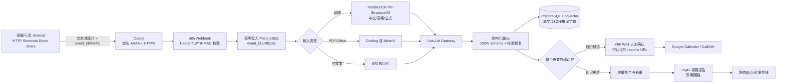

# 文本/截图到 AI 分类、结构化 JSON、知识报告与日历自动化调研

> 调研日期：2026-10-03  
> 目标环境：自建服务器、公网 IPv6、Windows 11、荣耀 Android、三星 Android 平板。  
> 偏好：开源、可自托管；允许按量使用云模型 API。  
> 资料口径：优先采用项目官方仓库、官方文档和第一方 API 规范。文中的“我的判断”均为结合本环境的工程结论，不是厂商承诺。

> **适用范围说明**：本文撰写于 v1.0 的“服务器中心”架构，v2.1 中 OCR 与模型链路改为三端 App 直连云端大模型 API，不在本地部署模型。结论请以 [个人 AI 收件箱与提醒系统：可执行方案](../personal-ai-inbox-executable-plan.md) 为准；本文的官方资料与能力边界仍然有效。

## 1. 结论先行

### 1.1 最推荐组合

**HTTP Shortcuts → Caddy/HTTPS → n8n Community → PaddleOCR PP-StructureV3（必要时 Docling）→ LiteLLM → 云端多模态/结构化模型 → PostgreSQL/pgvector → Jinja2 模板报告 → n8n Wait 人工确认 → Google Calendar 节点或 CalDAV HTTP。**

理由：

- HTTP Shortcuts 原生支持 Android 分享菜单、Direct Share、文件分享、JSON/cURL 导入、脚本、HMAC、UUID、变量和密钥型变量，满足“不开发原生 App”的入口要求。[HTTP Shortcuts 高级功能](https://http-shortcuts.rmy.ch/advanced)、[变量](https://http-shortcuts.rmy.ch/variables)、[脚本](https://http-shortcuts.rmy.ch/scripting)
- n8n 在个人/内部用途下可自托管，Webhook、等待/人工确认、错误工作流、LLM 节点和 Google Calendar 节点最完整。其 Sustainable Use License 禁止未经授权把软件作为付费服务提供；个人自用不受该商业分发限制。[n8n License](https://github.com/n8n-io/n8n/blob/master/LICENSE.md)、[Webhook](https://docs.n8n.io/integrations/builtin/core-nodes/n8n-nodes-base.webhook/)、[Wait](https://docs.n8n.io/integrations/builtin/core-nodes/n8n-nodes-base.wait/)
- PaddleOCR 对中文、简繁混合、表格、公式和版面更适合中文手机截图；LiteLLM 提供统一 OpenAI 兼容入口、重试/回退和结构化输出能力，避免把工作流绑定到单个模型厂商。[PaddleOCR](https://github.com/PaddlePaddle/PaddleOCR)、[PP-StructureV3](https://www.paddleocr.ai/latest/en/version3.x/pipeline_usage/PP-StructureV3.html)、[LiteLLM](https://github.com/BerriAI/litellm)
- 报告正文应由固定模板和结构化事实生成，LLM 只负责摘要/改写；日历写入前必须保留人工确认，避免截图误识别直接改变日程。

### 1.2 第二选择

**HTTP Shortcuts → Caddy/HTTPS → Activepieces（MIT 核心）→ PaddleOCR/Docling → LiteLLM → PostgreSQL/Redis → Jinja2 报告 → Waitpoint/审批 → Google Calendar Piece。**

Activepieces 核心是 MIT，且有 Webhook Trigger、Waitpoint、AI Providers、Google Calendar Piece；适合更看重宽松许可和 MIT 核心的用户。[Activepieces License](https://github.com/activepieces/activepieces/blob/main/LICENSE)、[Waitpoints](https://www.activepieces.com/docs/install/architecture/waitpoints)、[Webhook Trigger](https://www.activepieces.com/docs/build-pieces/piece-reference/triggers/webhook-trigger)

代价是：默认 Webhook 没有 n8n 那样的内建 Basic/Header/JWT 三选一鉴权；生产部署必须加反向代理、首步签名校验或自定义验证。核心是 MIT，但 EE 目录和若干企业能力另有商业许可。[Activepieces Enterprise License](https://www.activepieces.com/docs/install/configure-operate/enterprise-license)

### 1.3 明确排除的方案

| 方案 | 结论 | 主要原因 |
|---|---|---|
| Flowise | 不作为新项目基础 | 官方 README 已写明仓库 archived，并指向“Future of Flowise”讨论；维护风险不适合作为长期自动化底座。[Flowise README](https://github.com/FlowiseAI/Flowise#readme) |
| Node-RED 作为主编排 | 不作为首选 | Apache-2.0、运行时优秀，但核心节点不提供完整 LLM、日历和人工审批能力；这些依赖社区节点，许可证和维护质量分散。[Node-RED LICENSE](https://github.com/node-red/node-red/blob/master/LICENSE)、[Node-RED Library](https://flows.nodered.org/) |
| Open WebUI 作为自动化引擎 | 仅作为人工聊天/知识入口 | 它是自托管 AI 平台而非持久工作流引擎；API 文档明确标注为 experimental，且许可证对 50 人以上部署的品牌修改有限制。[Open WebUI License](https://github.com/open-webui/open-webui/blob/main/LICENSE)、[API Endpoints](https://docs.openwebui.com/reference/api-endpoints) |
| Dify 作为唯一编排 | 不推荐 | AI 工作流、RAG、结构化输出和视觉能力很强，但日历动作、人工审批队列和通用自动化连接不如 n8n；许可证还限制未经授权的多租户服务和前端 Logo 修改。[Dify License](https://github.com/langgenius/dify/blob/main/LICENSE) |
| Tesseract 作为主力 OCR | 仅作轻量降级 | 官方定位是行识别 OCR 引擎，不包含表格结构、公式和复杂版面理解；中文纯文本可用，但中文截图/表格/公式不适合。[Tesseract README](https://github.com/tesseract-ocr/tesseract) |
| MinerU 作为默认 CPU 解析器 | 仅用于 GPU 或有 16 GB 内存的任务队列 | 官方资源表显示 Standard/Advanced 的 PyTorch 路径需要 16 GB 内存和 8 GB+ 显存；许可还含 1 亿 MAU/2000 万美元月收入的商业门槛与在线服务署名义务。[MinerU README](https://github.com/opendatalab/MinerU)、[MinerU License](https://github.com/opendatalab/MinerU/blob/master/LICENSE.md) |
| Marker 作为默认解析器 | 可选，不作唯一依赖 | 代码 Apache-2.0，但模型权重是 OpenRAIL-M，超过 500 万美元融资/营收的商用需另购许可；资源与模型生态也比 PaddleOCR/Docling 更复杂。[Marker README](https://github.com/datalab-to/marker) |
| Tasker / Automate 作为主入口 | 不作为首选 | 能力更强但为闭源付费应用，配置和迁移成本高；HTTP Shortcuts 已覆盖本需求，且 MIT、可从 F-Droid/GitHub 安装。[Tasker Userguide](https://tasker.joaoapps.com/userguide/en/index.html)、[Automate](https://llamalab.com/automate/) |
| Termux 作为主入口 | 仅作高级备用 | 开源、强大，但官方明确提醒 Android 12+ 可能杀后台进程；签名、后台限制、插件来源和包管理会带来额外运维负担。[Termux README](https://github.com/termux/termux-app#readme) |
| PWA Share Target 作为主入口 | 建议作为跨设备备选 | 方案干净，但必须先安装 PWA，且需要维护 HTTPS、manifest 和 service worker；相对 HTTP Shortcuts 多一层前端开发。[Chrome Share Target](https://developer.chrome.com/docs/capabilities/web-apis/web-share-target) |

## 2. 目标架构



### 2.1 推荐的统一事件契约

```json
{
  "schema_version": "1.0",
  "event_id": "uuid-v4-from-device",
  "device_id": "huawei-or-tablet-id",
  "source": {
    "kind": "screenshot | shared_text | url | pdf",
    "captured_at": "2026-10-03T10:00:00+08:00",
    "file_refs": ["object://raw/..."],
    "ocr_ref": "object://ocr/...",
    "source_locator": "page=1;block=12;bbox=..."
  },
  "classification": {
    "category": "expense | task | event | note | receipt | unknown",
    "confidence": 0.93,
    "reason": "short deterministic explanation"
  },
  "facts": {
    "title": "string",
    "entities": [],
    "amounts": [],
    "dates": [],
    "deadlines": [],
    "action_items": []
  },
  "calendar_candidates": [
    {
      "title": "string",
      "start": "2026-10-04T09:00:00+08:00",
      "end": "2026-10-04T10:00:00+08:00",
      "timezone": "Asia/Hong_Kong",
      "location": "string",
      "needs_confirmation": true
    }
  ],
  "knowledge": {
    "summary": "string",
    "tags": [],
    "citations": [
      {
        "doc_id": "doc_...",
        "page": 1,
        "block": 12,
        "quote": "string",
        "confidence": 0.91
      }
    ]
  },
  "model_meta": {
    "gateway": "litellm",
    "model": "configured-model",
    "prompt_version": "classify-v3",
    "schema_hash": "sha256:..."
  }
}
```

我的判断：`event_id` 必须由设备端在每次按钮执行时生成，而不是服务端生成。HTTP Shortcuts 的 UUID 变量和 `uuidv4()` 脚本函数都满足这一要求。[HTTP Shortcuts Variables](https://http-shortcuts.rmy.ch/variables)、[Scripting](https://http-shortcuts.rmy.ch/scripting)

## 3. 工作流/编排平台

| 能力 | n8n | Windmill | Activepieces | Node-RED |
|---|---|---|---|---|
| 许可证 | Sustainable Use License；EE 文件另有商业许可 | 后端/前端多为 AGPLv3，客户端/OpenAPI 为 Apache-2.0；官方 Community 镜像还含非公开专有代码 | 核心 MIT Expat；`packages/ee/`、部分 server EE 路径为商业许可 | Apache-2.0 |
| Webhook | 强：HTTP 方法、Basic/Header/JWT、IP allowlist、二进制、16 MB 默认上限 | 强：Bearer token、细粒度 webhook token、同步/异步、multipart 文件、原始 body | 有：Webhook Trigger；默认目标 URL 需在外部加鉴权或流程首步自行验签 | 有：HTTP In；鉴权通常在反向代理或 flow 内实现 |
| 重试 | 节点级失败处理、错误工作流、失败执行重跑 | Trigger retry、Flow retry、错误处理器；底层明确为 at-least-once，业务需实现幂等 | 队列指数退避、步骤重试、Durable Execution；piece author 可声明 retryable/idempotent | 核心无统一重试节点；需 Catch/自定义流程或社区节点 |
| 人工确认 | 强：Wait 节点支持定时/Webhook/表单恢复，恢复 Webhook 可配 Basic/Header/JWT | 强：Suspend/Approval 步骤，等待时释放 worker | 强：Waitpoint + Barrier + Approval；等待持久化，重复 resume 由唯一约束吸收 | 核心无完整审批原语，通常依赖 Dashboard、Telegram 等 |
| LLM 节点 | 内建 AI Agent、LLM Chain、模型连接器 | 内建 AI Agent 步骤、AI provider 设置 | Agents、AI Providers、结构化输出生成 | 核心无；使用 HTTP Request 调 OpenAI 兼容接口或社区节点 |
| 日历 | 内建 Google Calendar Calendar/Event 操作与 Trigger | Google Calendar OAuth 集成、资源、原生触发器和 Hub 脚本 | 社区 Google Calendar Piece，官方源码存在 | 核心无；社区节点 |
| 自托管限制 | 个人/内部用途可自托管；不能免费包装成服务对外销售；EE 文件需商业许可 | 免费自托管执行不限；Community 镜像不得修改/包装/转售，EE 功能需商业许可 | 免费自托管；嵌入式 DB 的 Hobby 安装无法升级 Enterprise，多实例需 PostgreSQL/Redis | 无同类商业限制 |
| 总体适配 | **最适合**本需求 | 适合开发者、代码优先和大量并发 | **最适合开源许可优先的第二选择** | 适合事件/IoT，不适合当唯一 AI 自动化底座 |

### 3.1 n8n

官方 Webhook 节点支持 DELETE、GET、HEAD、PATCH、POST、PUT，支持 Basic Auth、Header Auth、JWT Auth、None、IP allowlist、CORS、二进制和原始 body；默认最大载荷 16 MB，自托管可调整。[n8n Webhook](https://docs.n8n.io/integrations/builtin/core-nodes/n8n-nodes-base.webhook/)

Wait 节点可以把执行数据卸载到数据库，在指定时间、Webhook 调用或表单提交后恢复。On Webhook Call 可以要求 Basic、Header 或 JWT 认证，并提供 `$execution.resumeUrl`；On Form Submitted 适合人工确认页。这正好覆盖“识别→用户确认→写日历”的流程。[n8n Wait](https://docs.n8n.io/integrations/builtin/core-nodes/n8n-nodes-base.wait/)

n8n 有独立错误工作流，工作流失败时可由 Error Trigger 启动统一告警、死信或补偿；还有专门的人机协同示例，用于要求 AI Agent 执行敏感工具前先批准。[n8n Error Handling](https://docs.n8n.io/flow-logic/error-handling/)、[Human-in-the-loop for tools](https://docs.n8n.io/build/integrate-ai/ai-examples/human-in-the-loop-for-tools)

### 3.2 Windmill

Windmill 每个脚本/Flow 可自动生成 Webhook；有同步、异步、SSE、版本固定 URL，并接受 JSON、表单、multipart 文件和非 JSON raw body。认证使用 Bearer token，也支持只能触发特定脚本/Flow 的 webhook-specific token。[Windmill Webhooks](https://www.windmill.dev/docs/core_concepts/webhooks)

Flow Editor 官方说明包含分支、循环、错误处理、approval steps 和 retries；Suspend 步骤只在收到恢复/取消事件后继续，适合人工确认。Windmill 明确把引擎描述为 at-least-once，关键副作用必须由业务代码实现幂等。[Windmill Flow Editor](https://www.windmill.dev/docs/flows/flow_editor)、[Windmill Error Handling](https://www.windmill.dev/docs/core_concepts/error_handling)

Google Calendar 可以通过 OAuth 资源连接，并可用原生触发器接收创建、更新、删除事件；创建/更新事件仍建议用脚本调用 API。[Windmill Google Calendar](https://www.windmill.dev/docs/integrations/gcal)

我的判断：Windmill 更适合“开发者在代码里定义工作流”的场景。若你的重点是 Android 分享后可视化编排、日历节点和快速人工确认，n8n 更省事。

### 3.3 Activepieces

核心 MIT 很友好。Waitpoint 官方定义为持久暂停记录，支持 DELAY、WEBHOOK、BARRIER；插入对 `(flow run, step)` 幂等，重复回调由唯一约束吸收，WEBHOOK 恢复链接使用随机不可猜测 token。它还对 resume-before-pause 竞态做了处理。[Activepieces Waitpoints](https://www.activepieces.com/docs/install/architecture/waitpoints)

Webhook Trigger 的通用实现把请求 body 交给 piece；公开 URL 可以在反向代理或首步中做 HMAC/Header 校验。若涉及 multipart 文件，官方文档明确当前 multipart webhook 的 HMAC 校验不受支持，因此不要把“签名覆盖上传文件”当作已解决项。[Activepieces Webhook Trigger](https://www.activepieces.com/docs/build-pieces/piece-reference/triggers/webhook-trigger)

生产自托管不要用嵌入式数据库 Hobby 模式；该模式不能升级 Enterprise。多实例和持久任务应使用 PostgreSQL + Redis。[Activepieces Hobby Install](https://www.activepieces.com/docs/install/options/docker)

### 3.4 Node-RED

Node-RED 的优点是 Apache-2.0、运行时稳定、部署轻、事件/IoT 集成广。它的不足是核心能力是通用流处理，不是为 AI Agent、RAG、审批和日历而生。LLM 和日历需要从 Node-RED Library 选择社区节点或直接 HTTP Request 调用。

我的判断：如果已有大量 Node-RED 设备自动化和 MQTT 流程，可以把 Node-RED 作为“设备边缘层”，统一转发到 n8n/Windmill；不建议把 Node-RED 当知识报告和日历审批的主控制器。

## 4. AI 接入与模型层

| 能力 | Open WebUI | Dify | Flowise | Langflow | LiteLLM |
|---|---|---|---|---|---|
| 核心定位 | 自托管 Chat/RAG 工作台 | AI 应用、Workflow、RAG、Agent 平台 | 可视化 AI Flow | 可视化 AI Flow/Agent | 多模型网关 |
| 许可证 | Open WebUI License；>50 用户默认不得移除/替换品牌，除非有额外许可 | 修改版 Apache-2.0；未经授权禁止多租户服务，前端 Logo/版权不可改 | Apache-2.0 核心；企业目录商业许可；仓库已 archived | MIT | MIT 核心；`enterprise/` 另许许可 |
| 结构化输出 | 主要依赖上游模型或自定义 Tool/Function；不是核心持久编排能力 | 强：LLM 节点支持 JSON Schema/Visual Editor/AI 生成 schema；Parameter Extractor 支持 Function Call/Tool Call | 有 Structured Output Parser/Zod schema，但归档后不建议新投产 | 有 Structured Output 组件，依赖模型和解析器 | 支持 Structured Outputs，可传 Pydantic 模型；适合作为统一模型出口 |
| 视觉模型 | 连接 OpenAI 兼容/Anthropic 等模型；支持图片生成和上传图像；OCR 可由 Docling/PaddleOCR-VL 等抽取器完成 | LLM 节点支持图像/文档；视觉 detail 可选 high/low | 可接视觉模型和多模态模型 | 可接视觉模型 | 可统一路由支持视觉的模型，并统一错误/费用 |
| 知识库/RAG | 强：本地 RAG、9 类向量库、Tika/Docling/Mistral OCR/PaddleOCR-VL 等抽取器、混合检索/重排 | 强：从文档摄入到检索、引用跟踪的 RAG pipeline | 强但维护风险 | 强，适合原型/开发 | 本身不做知识库；应配 PostgreSQL+pgvector/Qdrant |
| API 稳定性 | 官方 API 文档明确为 experimental | 提供 OpenAPI service spec 和完整 API；仍需固定版本/契约测试 | 有 API/Swagger，但项目已归档 | `/v1/run`、`/v1/webhook` 已文档化；v2 Workflow API 仍标 Beta | OpenAI-compatible API；官方提供 `-stable` 镜像并建议生产使用 |
| 适合角色 | 人工聊天、上传文件、临时 RAG | AI 应用/RAG 层，不强求其负责日历队列 | 不新建 | 开发者原型和 AI 后端 | **必须作为模型边界层** |

### 4.1 Open WebUI

官方 README 明确支持 Ollama、任何 OpenAI-compatible API、Tool/Filter/Action/Pipeline、原生 MCP、本地 RAG 和多种文档提取器，其中已包含 Docling、PaddleOCR-VL 和外部 loader。[Open WebUI README](https://github.com/open-webui/open-webui)

但 API 文档写的是 experimental，可能变化；许可证对 50 人以上部署的品牌修改有额外条件。[Open WebUI API](https://docs.openwebui.com/reference/api-endpoints)、[Open WebUI License](https://github.com/open-webui/open-webui/blob/main/LICENSE)

我的判断：Open WebUI 适合作为本系统的“人工查看/追问/临时上传”前端，不适合作为需要重试、幂等、审批和日历副作用的持久工作流引擎。

### 4.2 Dify

Dify 的 LLM 节点支持结构化输出三种配置方式：可视化字段编辑器、直接 JSON Schema、自然语言生成 schema；支持视觉输入、上下文变量和自动引用来源。Parameter Extractor 能用 Function/Tool Call 或纯 Prompt 将自然语言转成预定义参数。[Dify LLM Node](https://docs.dify.ai/en/guides/workflow/node/llm)、[Parameter Extractor](https://docs.dify.ai/en/guides/workflow/node/parameter-extractor)

许可证允许商业使用和作为企业应用平台，但未经书面授权不得运营多租户环境，且使用其前端时不能移除/修改控制台或应用中的 Logo/版权信息。[Dify License](https://github.com/langgenius/dify/blob/main/LICENSE)

我的判断：Dify 最适合承担“OCR 后文本/图片 → AI 分类/摘要/RAG”的 AI 中间层。日历写入、人工确认和通用连接交给 n8n 更稳。

### 4.3 Flowise

Flowise 在功能上具备 Structured Output Parser、RAG、API 和大量集成，但其 README 已明确 archived。归档项目仍可自托管，但不应作为新系统的长期依赖。[Flowise README](https://github.com/FlowiseAI/Flowise#readme)、[Flowise License](https://github.com/FlowiseAI/Flowise/blob/main/LICENSE.md)

### 4.4 Langflow

Langflow 是 MIT 许可，支持把 Flow 发布为 API、MCP server 或 OpenAI Responses-compatible endpoint；官方 API 文档给出 `/v1/run/{flow_id_or_name}`、`/v1/webhook/{flow_id_or_name}` 等端点。[Langflow README](https://github.com/langflow-ai/langflow)、[Langflow API](https://docs.langflow.org/api-reference-api-examples)、[Publish Flow](https://docs.langflow.org/concepts-publish)

安全性方面，官方明确说明单个 Langflow 进程不强制用户隔离，也不限制访问本地磁盘/网络；多租户隔离必须由基础设施完成。[Langflow Security](https://docs.langflow.org/security)

我的判断：Langflow 适合开发者在可信内网做 flow 原型或独立 AI API。若对外暴露，必须放在认证网关和容器隔离之后，不能把它当作多租户安全边界。

### 4.5 LiteLLM

LiteLLM 核心是 MIT，提供统一 OpenAI 格式的 SDK 和自托管 Gateway；主要价值是：

- 统一 100+ providers 的接口和错误格式；
- 支持 structured output、vision、tool calling；
- 支持 Router retry/fallback、负载均衡、虚拟 key、预算、速率限制、guardrails 和 spend tracking；
- 官方提供 `-stable` 镜像标签，表示经过 load test 后发布。

来源：[LiteLLM README](https://github.com/BerriAI/litellm)、[Structured output](https://docs.litellm.ai/docs/harness/structured_output)、[Routing](https://docs.litellm.ai/docs/routing)、[Guardrails](https://docs.litellm.ai/docs/proxy/guardrails/quick_start)、[Release cycle](https://docs.litellm.ai/docs/proxy/release_cycle)

我的判断：即使你只接一家云模型，也建议先接 LiteLLM，因为后续可无痛切换模型、加本地模型、做预算熔断、审计和 PII guardrail。

## 5. OCR/文档解析

| 工具 | 许可证 | 中文/手机截图 | 表格 | 公式 | 资源特点 | 推荐角色 |
|---|---|---|---|---|---|---|
| PaddleOCR | Apache-2.0 | 很强，简繁/中英/手写/竖排 | 强，PP-StructureV3 | 强，可开关公式识别 | 支持 CPU/GPU/XPU/NPU；移动模型小，完整结构管线较慢 | **首选** |
| Tesseract | Apache-2.0 | 可用，取决于语言包和预处理 | 无原生表格结构 | 无原生公式理解 | CPU、轻量、无 GUI | 纯文本降级 |
| Docling | MIT | 可配 RapidOCR（简中默认） | 强 | 强，支持公式 enrichment | CPU/GPU 均可；模型下载和依赖较重 | PDF/Office 主解析 |
| Marker | 代码 Apache-2.0；模型 OpenRAIL-M | 全语言；中文需自测 | 强 | 强 | CPU fast/no-OCR 或 GPU VLM；资源/许可较复杂 | GPU 可选高质量解析 |
| MinerU | Apache-2.0 + 附加门槛 | 很强，中文与复杂文档 | 很强 | 很强 | 官方明确 2/8/16 GB 内存档和 8 GB+ VRAM 高档 | GPU 批量解析 |
| Unstructured | Apache-2.0 核心 | 依赖 OCR 语言包 | hi_res 可做 | 非重点 | hi_res 模型+Tesseract；多列排序有局限 | RAG 预处理/降级 |

### 5.1 PaddleOCR

官方 README 当前将 PaddleOCR 定位为 PDF/图片转结构化 JSON/Markdown 的文档解析工具；PP-OCRv6 单模型覆盖中文、英文、日文和 46 种拉丁文字；PaddleOCR-VL-1.6 为 0.9B 轻量文档 VLM，官方称在文本、公式和表格识别上表现强，并输出 Markdown/JSON。[PaddleOCR README](https://github.com/PaddlePaddle/PaddleOCR)

PP-StructureV3 管线包括版面分析、通用 OCR、表格识别、公式识别、印章识别、图表解析和 Markdown 输出；官网给出模型级 CPU/GPU 延迟。例如：

- `PP-OCRv5_mobile_det` 约 4.7 MB，CPU 约 57.77/28.15 ms；
- `PP-OCRv5_mobile_rec` 约 136 MB，CPU 约 21.20/5.32 ms；
- 轻量 `PP-DocLayout-S` 约 4.8 MB，CPU 约 18.53/6.29 ms；
- 高精度 `PP-DocLayout_plus-L` 约 126 MB，CPU 约 634.62/378.32 ms。

来源：[PP-StructureV3 官方文档](https://www.paddleocr.ai/latest/en/version3.x/pipeline_usage/PP-StructureV3.html)

我的判断：对手机截图和中文内容，优先使用移动 OCR 模型 + 轻量版面模型；只有票据表格、公式、复杂截图才启用重型结构模型。若服务器有 NVIDIA GPU，使用 GPU 明显降低延迟。

### 5.2 Tesseract

Tesseract 是 LSTM 行识别引擎，支持 UTF-8、100+ 语言和文本/hOCR/PDF/TSV/ALTO/PAGE 等输出；官方 README 也强调通常需要先改善输入图像质量。它不提供表格结构恢复或公式语义。[Tesseract README](https://github.com/tesseract-ocr/tesseract)、[Output Formats](https://tesseract-ocr.github.io/tessdoc/OutputFormats.html)

我的判断：Tesseract 是低资源兜底：只做纯中文/英文文本时可用；不要把表格、公式或复杂 App 截图布局当作它的强项。

### 5.3 Docling

Docling 解析 PDF、DOCX、PPTX、XLSX、HTML、EPUB、图片、LaTeX、邮件、音频等格式，支持版面、阅读顺序、表格结构、代码、公式、图像分类和 OCR；OCR 引擎可选 RapidOCR、Tesseract、EasyOCR、Nemotron-OCR、ocrmac 或远程 KServe。RapidOCR 默认模型是简体中文，也支持 `iso:zh-Hant` 等标签。[Docling README](https://github.com/docling-project/docling)、[Docling OCR](https://docling-project.github.io/docling/concepts/OCR/)

官方安装文档说明 Docling 支持 macOS、Linux、Windows 和 x86_64/arm64，也提供 CPU-only PyTorch 安装方式；GPU 是可选加速项。[Docling Installation](https://docling-project.github.io/docling/getting_started/installation/)

我的判断：若输入 PDF/Office 多于手机截图，Docling 是最平衡的自托管选择；若输入主要是中文手机截图，PaddleOCR 更直接。

### 5.4 Marker

Marker 支持 PDF、图片、PPTX、DOCX、XLSX、HTML、EPUB，保留表格、表单、方程、内联数学、链接、引用和代码，并能抽取图片。它可在 GPU、CPU、MPS 上运行；CPU 可用 `fast`/`--disable_ocr` 路径，不启动 VLM 服务器，适合有文本层的数字 PDF。[Marker README](https://github.com/datalab-to/marker)

官方 README 说明代码 Apache-2.0，但模型权重是修改版 OpenRAIL-M：研究、个人和 500 万美元以下融资/营收的初创公司可免费使用，超过则需商业许可。

我的判断：若已有 GPU，Marker balanced 对公式/复杂表格很值得 A/B；但它的模型权重许可和 CPU 能力边界，使其不适合作为无 GPU 的单点默认解析器。

### 5.5 MinerU

MinerU 官方 README 给出四级解析和硬件表：

| 路径 | 模型下载 | 最低内存 | 加速器 |
|---|---:|---:|---|
| basic / ONNX | ~0.8 GB | 2 GB | CPU 可运行 |
| basic / PyTorch | ~0.8 GB | 8 GB | 建议 GPU/MPS |
| standard/advanced / ONNX + llama.cpp | ~2 GB | 8 GB | CPU 可运行，推荐 Vulkan |
| standard/advanced / PyTorch + llama.cpp | ~2 GB | 16 GB | GPU/MPS，8 GB+ VRAM |
| standard/advanced / PyTorch + vLLM/lmdeploy/mlx | ~3 GB | 16 GB | GPU/MPS，8 GB+ VRAM |

来源：[MinerU README](https://github.com/opendatalab/MinerU)

MinerU 还提供稳定 locator：`doc:{short_id}/tier:{tier}/page:{page}/block:{block}`，对引用回链很有价值。许可证是 Apache-2.0 + 附加条件：月活超过 1 亿或月收入超过 2000 万美元需单独商业许可；向第三方提供在线服务必须显著署名。[MinerU License](https://github.com/opendatalab/MinerU/blob/master/LICENSE.md)

我的判断：MinerU 是最强的高质量 PDF/复杂文档解析选项之一，但应与 CPU 快速路径分开：只在队列任务中调用 Standard/Advanced，并保持超时、重试和降级。

### 5.6 Unstructured

Unstructured 的 `partition_pdf` 支持 `auto`、`fast`、`hi_res`、`ocr_only`。`hi_res` 用 `detectron2_onnx` 做版面，但官方说明多列且无文本层文档的元素排序仍有困难；`ocr_only` 走 Tesseract，`fast` 走 pdfminer。[Unstructured Partitioning](https://docs.unstructured.io/open-source/core-functionality/partitioning)

元素级 chunking 能保留表格、标题、页码和优先级结构，`by_title` 可保持 section 边界，原始元素可在 `metadata.orig_elements` 中追踪。[Unstructured Chunking](https://docs.unstructured.io/open-source/core-functionality/chunking)

我的判断：Unstructured 适合 RAG 预处理、表格到 HTML、保留元素 provenance；但它默认依赖 Tesseract，公式不是重点能力，因此不建议作为中文截图/公式的核心引擎。

## 6. Android 快速入口

| 方案 | 开源/收费 | 免开发入口 | 文本分享 | 图片分享 | 自动化/脚本 | 结论 |
|---|---|---|---|---|---|---|
| HTTP Shortcuts | MIT，免费 | 强：桌面快捷方式、Quick Settings、App Shortcut、Direct Share、deep link | 支持 | 支持；文件可作 body 或 form-data | JavaScript、HMAC、UUID、变量、Tasker/Termux 集成 | **首选** |
| Tasker | 闭源付费 | 强：Intent、分享、桌面、条件触发 | 支持 | 支持 | 很强，生态成熟 | 第二入口 |
| Automate | 闭源免费+内购 | 强：flowchart、Intent、分享 | 支持 | 支持 | HTTP Request、Locale/Tasker API | 图形化备用 |
| Termux | GPLv3 | 弱：需要命令、widget 或 Tasker 启动 | 可做 | 可做 | shell/curl/API 极强 | 高级备用 |
| PWA Share Target | 取决于自建前端 | 中：安装后出现在系统分享面板 | 支持 | 支持文件 | 需要 service worker/后端 | 跨设备备选 |

### 6.1 HTTP Shortcuts 具体做法

1. 创建全局变量 `shared_value`，开启 “Allow Receiving Value from Share Dialog”，选择接收 text、title 或两者。
2. 创建普通 HTTP Shortcut，`POST` 到 `https://your-domain/webhook/ingest`；需要图片时把 Request Body 设为 File Picker 或 Parameters/form-data。
3. 在 Trigger & Execution Settings 中开启 Direct Share，Android 11+ 可直接出现在分享面板。
4. 使用 `uuidv4()` 生成 event id；使用 `hmac('SHA-256', secret, msg_id + '.' + timestamp + '.' + body)` 生成签名；把 `webhook-id`、`webhook-timestamp`、`webhook-signature` 放到请求头。
5. 把 API token/secret 变量标记为 secret，并开启 App 锁定；HTTP Shortcuts 官方仍说明 secret 变量“不完全保护”，导出时可选排除值，但不能替代设备锁和应用锁。

来源：[Share text](https://http-shortcuts.rmy.ch/advanced#share-text)、[Share files](https://http-shortcuts.rmy.ch/advanced#share-files)、[Variables](https://http-shortcuts.rmy.ch/variables)、[Permissions](https://http-shortcuts.rmy.ch/permissions)、[Scripting](https://http-shortcuts.rmy.ch/scripting)

我的判断：HTTP Shortcuts 是最低成本且最符合需求的入口。若担心密钥落在手机端，使用低权限、可撤销的 per-device token；真正高敏感操作使用服务端确认，而不是手机端直接执行。

### 6.2 Tasker / Automate / Termux / PWA

- Tasker 的官方用户手册提供完整 Task/Action/Intent/Variable 模型，适合复杂触发和跨 App 控制，但闭源付费。[Tasker Userguide](https://tasker.joaoapps.com/userguide/en/index.html)
- Automate 提供可视化 flowchart 和 HTTP Request block，支持上传文本/文件，并处理网络失败；适合不喜欢文本配置的用户。[Automate HTTP Request](https://llamalab.com/automate/doc/block/http_request.html)
- Termux 官方强调无需 root 的 Linux 环境，但 Android 12+ 会杀过多后台进程；适合作 SSH、批处理、临时维护，不适合当稳定分享入口。[Termux](https://termux.dev/en/)
- PWA Share Target 官方要求先安装 PWA，且接受文件时 `method` 必须为 POST、enctype 为 multipart/form-data；适合以后做跨平台统一入口。[Chrome Share Target](https://developer.chrome.com/docs/capabilities/web-apis/web-share-target)

## 7. 知识报告架构

### 7.1 模板渲染 vs LLM 生成

推荐使用“结构化事实 + 模板渲染 + 局部 LLM 改写”的混合方案：

| 层级 | 负责者 | 不应该交给 LLM 的内容 |
|---|---|---|
| 原始文本/OCR | PaddleOCR/Docling | 删除原文、篡改金额/日期 |
| 分类和抽取 | 模型 + JSON Schema | 自由生成未出现的事实 |
| 事实校验 | 规则、schema、数据库约束 | 金额算术、日期推断、去重主键 |
| 报告叙述 | LLM 只改写 `summary`、`bullets`、`action_items` | 标题/日期/引用/金额的事实源 |
| 最终渲染 | Jinja2/Markdown/静态站点 | 允许模型直接拼 HTML |

Jinja2 是成熟的模板引擎，适合确定性的日报/周报模板。[Jinja2 官方文档](https://jinja.palletsprojects.com/)

### 7.2 引用回链

每个知识条目都应保留最小可验证来源：

- `doc_id` 或原始文件 hash；
- `page`；
- `block/line id` 或 `bbox`；
- 文本 quote；
- OCR confidence；
- 模型名和 prompt/schema version。

PaddleOCR 的结构化结果可返回文字、表格单元格等多级坐标；MinerU 提供稳定 page/block locator；Docling 有统一文档模型；Unstructured 的 chunk metadata 保留原始 elements 和坐标。[PaddleOCR PP-StructureV3](https://www.paddleocr.ai/latest/en/version3.x/pipeline_usage/PP-StructureV3.html)、[MinerU README](https://github.com/opendatalab/MinerU)、[DoclingDocument](https://docling-project.github.io/docling/concepts/docling_document/)、[Unstructured Chunking](https://docs.unstructured.io/open-source/core-functionality/chunking)

报告渲染时把 citation 转成：

```text
[S1](/knowledge/docs/{doc_id}#{block_id})
```

我的判断：不要只用“文档名”做引用。没有页码/块号/bbox 的引用无法复核，也不能在 OCR 修正后保持稳定。

### 7.3 去重与增量整理

推荐四级去重：

1. **事件幂等**：Webhook 的 `event_id` 存 PostgreSQL UNIQUE；重复请求直接返回既有结果。Standard Webhooks 明确建议把 `webhook-id` 作为 idempotency key。[Standard Webhooks](https://github.com/standard-webhooks/standard-webhooks/blob/main/spec/standard-webhooks.md)
2. **原始文件去重**：全文 SHA-256 + 文件大小 + mime + 规范化 OCR 文本 hash。
3. **语义近重复**：normalized text、SimHash/MinHash 或 embedding 相似度。向量候选只标“可能重复”，人工或规则确认后才合并。
4. **知识条目合并**：以稳定 `entity_id`/`canonical_key` 为主键，采用 upsert；报告按时间窗口从事实表重算，不直接改写历史报告。

PostgreSQL 唯一约束适合做最后一道幂等门；pgvector 适合存储 embedding 和做相似检索。[PostgreSQL Unique Constraints](https://www.postgresql.org/docs/current/ddl-constraints.html)、[pgvector](https://github.com/pgvector/pgvector)

我的判断：手机截图里的“金额/日期/会议名”很容易被重复分享。不要把 LLM 相似度判断直接作为删除依据；先写 ledger，再通过 `canonical_key` 或人工确认合并。

### 7.4 报告发布

推荐：

- Markdown 为事实源；
- Jinja2 生成 `daily/YYYY-MM-DD.md`；
- MkDocs Material 发布静态知识站；
- 原文/OCR 图/JSON 存在对象存储；
- PostgreSQL 保存索引、引用、审批和幂等状态。

来源：[MkDocs Material](https://squidfunk.github.io/mkdocs-material/)

## 8. 安全与可靠性

### 8.1 Webhook 鉴权

- 公网入口只暴露反向代理 443，内部服务不直接映射到公网。
- 使用 DNS AAAA 指向服务器，外面用域名而不是裸 IPv6；URL 中 IPv6 字面量必须用方括号，例如 `https://[2001:db8::1]/...`。[RFC 3986](https://www.rfc-editor.org/rfc/rfc3986)
- 用 Caddy 或等价网关自动签发/续期 TLS，并把 HTTP 重定向到 HTTPS。[Caddy Automatic HTTPS](https://caddyserver.com/docs/automatic-https)
- n8n Webhook 至少启用 Header Auth 或 JWT；如果客户端能计算 HMAC，再加 `webhook-id`、`webhook-timestamp`、`webhook-signature`。
- 不要在 query string 或 webhook path 里放 API key。Standard Webhooks 推荐签名 `msg_id.timestamp.payload`，并校验时间戳容忍窗口、常量时间比较签名。[Standard Webhooks](https://github.com/standard-webhooks/standard-webhooks/blob/main/spec/standard-webhooks.md)
- GitHub 的官方 webhook 指南也建议：不要 `==` 比较签名，使用常量时间比较；`X-GitHub-Delivery` 可用于识别重放，重投的同一事件保持同一 delivery id。[GitHub Webhook Best Practices](https://docs.github.com/en/webhooks/using-webhooks/best-practices-for-using-webhooks)

### 8.2 幂等和重试

- 设备端每个逻辑事件生成 UUID；服务端 `events(event_id) UNIQUE`。
- 数据库事务内先占位 `event_id`，处理成功后写结果；重复请求直接返回第一次结果。
- 不需要“同一份截图多天重复处理”时，使用 file hash 过滤。
- 重试只针对 429、5xx、网络错误和超时；4xx 不应无限重试。
- 使用指数退避 + jitter，并设置最大重试次数和 dead-letter queue。Standard Webhooks 给出了从立即、5 秒、5 分钟、30 分钟到数小时的退避示例。
- n8n 用 error workflow；Windmill 用 retry/error handler；Activepieces 用 queue retry 和 durable execution。

来源：[Standard Webhooks](https://github.com/standard-webhooks/standard-webhooks/blob/main/spec/standard-webhooks.md)、[n8n Error Handling](https://docs.n8n.io/flow-logic/error-handling/)、[Windmill Error Handling](https://www.windmill.dev/docs/core_concepts/error_handling)、[Activepieces Durable Execution](https://www.activepieces.com/docs/install/architecture/durable-execution)

### 8.3 人工确认队列

需要确认的动作至少包括：

- 创建/修改日历；
- 对外发消息；
- 删除/合并知识条目；
- 处理金额、合同、身份、医疗等高风险内容；
- 低置信 OCR（例如 `confidence < 0.85`）。

实现建议：

- n8n：Wait node 的 Form Submitted 或 On Webhook Call；resume Webhook 启用 Header/JWT 或一次性签名 token，不暴露无认证 URL。
- Windmill：Suspend + Approval 步骤，等待时释放 worker。
- Activepieces：Waitpoint/Barrier；其 token 随机不可猜测，重复 resume 被唯一约束吸收，但业务仍要校验审批人身份。

来源：[n8n Wait](https://docs.n8n.io/integrations/builtin/core-nodes/n8n-nodes-base.wait/)、[Windmill Flow Editor](https://www.windmill.dev/docs/flows/flow_editor)、[Activepieces Waitpoints](https://www.activepieces.com/docs/install/architecture/waitpoints)

### 8.4 敏感信息与云模型数据边界

推荐数据路径：

```text
原图/原文只在本机保存
  -> 本机 OCR/裁剪
  -> 去除非必要状态栏、通知、头像、订单号
  -> LiteLLM PII/Guardrail
  -> 只发送需要的文本片段或局部图片
  -> 云端模型
  -> JSON 返回后再本地落库
```

OpenAI 官方数据页明确：自 2023-03-01 起，API 数据默认不用于训练，除非用户显式选择共享；默认 abuse monitoring logs 可保留最多 30 天；Zero Data Retention/Modified Abuse Monitoring 需申请批准，且某些端点/能力不适用 ZDR。图片和文件输入即使启用 ZDR，也可能因 CSAM 分类器命中而保留以供人工审查。[OpenAI Your Data](https://developers.openai.com/api/docs/guides/your-data)

视觉 API 可接收图片 URL 或 Base64 data URL，图片会计入 token 和费用。[OpenAI Vision](https://platform.openai.com/docs/guides/vision)

我的判断：

- 默认不要上传整张手机截图；先本地 OCR，只把必要文本发给云端。
- 必须使用视觉模型时，裁剪截图主体，去掉通知、账号、二维码、手机号和订单号。
- 把云 API 视为“外部处理器”，在数据分类中明确哪些字段可出网；为高敏感数据配置本地模型或 ZDR/企业数据控制。
- 用 LiteLLM guardrails 做出网前 PII 检测/掩码、Prompt Injection 检测和输出审计，但不要把它当唯一防线。

### 8.5 API 稳定性和版本管理

| 组件 | 建议 |
|---|---|
| n8n/Activepieces/Windmill | 固定镜像 digest；升级前导出 workflow/flow 并跑回归样例 |
| LiteLLM | 生产固定 `-stable` 镜像；模型配置和 API key 分离 |
| Dify/Langflow | 固定部署版本；对 `/run`/`/webhook` 做契约测试 |
| Open WebUI | 视为 experimental API，固定版本，不把 UI 数据库当主事实库 |
| OCR 模型 | 固定模型版本；schema 中记录 `ocr_model`、`ocr_version` |
| 结构化输出 | 使用 JSON Schema/Pydantic/Zod，CI 检查 schema 与类型不漂移 |

OpenAI Structured Outputs 支持 JSON Schema 子集，能保证结构符合 schema，但仍可能内容错误；不支持的 schema 会报错，根对象必须是 object，`additionalProperties: false` 是常见要求。[OpenAI Structured Outputs](https://developers.openai.com/api/docs/guides/structured-outputs)

## 9. 落地实施建议

### 9.1 最推荐技术组合

**入口**

- 荣耀手机：HTTP Shortcuts，Direct Share + 图片/文本快捷方式。
- 三星平板：HTTP Shortcuts，同一份导出配置导入。
- 共享事件携带 `event_id`、`device_id`、timestamp、HMAC。

**网络**

- DNS 域名 AAAA 指向服务器 IPv6；
- Caddy 监听 443，自动 TLS，反代 n8n/OCR/LiteLLM；
- 仅暴露公网入口，PostgreSQL、Redis、OCR、LiteLLM 放内网 Docker 网络。

**编排**

- n8n Community：Webhook、幂等占位、OCR 路由、LiteLLM 调用、Wait 确认、Google Calendar、错误工作流。
- 所有 workflow 固定版本，导出 JSON 进 Git。

**OCR**

- 手机截图：PaddleOCR PP-OCRv5/6 mobile + `PP-StructureV3` 轻量版面。
- PDF/Office：Docling；有 GPU 时可选 MinerU Standard/Advanced。
- 廉价兜底：Tesseract，仅处理纯文本。

**模型**

- LiteLLM → 云模型或本地 VLM。
- 结构化提取用 JSON Schema；校验失败自动重试一次，二次失败进人工队列。
- 不把图片直接长期缓存在云侧。

**数据**

- PostgreSQL：events、documents、facts、calendar_candidates、approvals、idempotency。
- pgvector：RAG/近重复候选。
- S3/MinIO：原图、OCR、报告快照。

**报告**

- Jinja2 模板生成 Markdown。
- 每条事实带 `source_refs`。
- 每天/每周重算报告；不直接覆盖历史。

**日历**

- 先写 `calendar_candidates`，n8n Wait/Form 确认后再调用 Google Calendar 节点。
- 若拒绝 Google 生态，可用 CalDAV HTTP 或本地 Calendar API。

### 9.2 第二选择技术组合

- n8n 替换为 Activepieces（MIT 核心 + PostgreSQL/Redis）。
- Webhook 入口在 Caddy 或首步完成 HMAC/Header 验证。
- OCR/模型/数据库/报告链路保持一致。
- 人工确认使用 Waitpoint/Barrier。
- Google Calendar 使用社区 Piece。

### 9.3 纯开源/本地模型的升级路线

- LiteLLM 后接本地 Qwen-VL 或其他中文视觉模型；
- PaddleOCR + Docling 完全本机；
- 报告生成使用本地 instruct 模型或仅模板；
- 此路线数据边界最好，但需要 GPU/内存预算，且模型升级和 prompt 评估工作量显著增加。

### 9.4 服务器与 Windows 11

我的判断：

- 长期运行优先 Linux 服务器；Windows 11 适合开发、批处理或作为 Docker Desktop/WSL2 工作机。
- 若必须 Windows 11 常驻运行，建议 Docker Desktop/WSL2 + PostgreSQL + Caddy；不要让多个服务共用无隔离的宿主机 Python 环境。
- 资源基线：无 GPU 时至少 8 GB RAM 用于 n8n/Activepieces + PostgreSQL + LiteLLM + PaddleOCR mobile；运行 MinerU Standard 或本地 VLM 时按官方要求准备 16 GB RAM 和 8 GB+ VRAM。

### 9.5 建议的首期验收样例

至少准备这些真实样本：

1. 微信/短信/银行 App 的中文纯文本截图。
2. 中文+英文混合的日程/活动海报。
3. 带表格的票据或课表截图。
4. 含公式/符号的 PDF 页面。
5. 重复分享同一张截图。
6. 模糊、截断、深色模式、超长滚动截图。
7. 带手机号、邮箱、订单号、二维码的敏感截图。
8. 跨时区事件和只有相对日期的事件（“下周三下午三点”）。

验收指标：

- 分类准确率；
- JSON schema 通过率；
- 金额/日期字段精确率（比总体准确率更重要）；
- p95 延迟；
- 重复事件率；
- 人工确认修改率；
- 外发数据字节数和敏感字段漏检数；
- OCR/重跑成本。

## 10. 最终判断

| 排名 | 方案 | 适合场景 | 核心风险 |
|---|---|---|---|
| 1 | HTTP Shortcuts + n8n + PaddleOCR + LiteLLM + PostgreSQL/pgvector + Jinja2/MkDocs | 个人/家庭/内部自用，要求少写代码、连接多、审批和日历完整 | n8n 不是 OSI 标准开源许可；需遵守内部用途/服务化限制 |
| 2 | HTTP Shortcuts + Activepieces + PaddleOCR + LiteLLM + PostgreSQL/pgvector | 更看重 MIT 核心和开源许可 | Webhook 鉴权需额外实现；部分企业功能收费 |
| 3 | HTTP Shortcuts + Windmill + Docling/PaddleOCR + LiteLLM | 开发者、代码优先、大规模并发 | 学习曲线更高；Community 镜像含专有代码和限制 |
| 4 | HTTP Shortcuts + Dify + n8n | 需要强 AI 工作流/RAG 管理，同时保留 n8n 做外部动作 | 两套平台增加资源、数据和升级复杂度 |
| 不建议 | Flowise / Node-RED-only / Open WebUI-only / Tesseract-only | 特定兼容或实验场景 | 归档、能力缺口或维护风险 |

## 11. 官方资料索引

### 工作流

- n8n: [Webhook](https://docs.n8n.io/integrations/builtin/core-nodes/n8n-nodes-base.webhook/)、[Wait](https://docs.n8n.io/integrations/builtin/core-nodes/n8n-nodes-base.wait/)、[Error Handling](https://docs.n8n.io/flow-logic/error-handling/)、[AI](https://docs.n8n.io/build/integrate-ai/)、[Google Calendar](https://docs.n8n.io/integrations/builtin/app-nodes/n8n-nodes-base.googlecalendar/)、[License](https://github.com/n8n-io/n8n/blob/master/LICENSE.md)
- Windmill: [Webhooks](https://www.windmill.dev/docs/core_concepts/webhooks)、[Flow Editor](https://www.windmill.dev/docs/flows/flow_editor)、[Error Handling](https://www.windmill.dev/docs/core_concepts/error_handling)、[AI Agents](https://www.windmill.dev/docs/core_concepts/ai_agents)、[Google Calendar](https://www.windmill.dev/docs/integrations/gcal)、[License](https://github.com/windmill-labs/windmill/blob/main/LICENSE)
- Activepieces: [Webhook Trigger](https://www.activepieces.com/docs/build-pieces/piece-reference/triggers/webhook-trigger)、[Waitpoints](https://www.activepieces.com/docs/install/architecture/waitpoints)、[Durable Execution](https://www.activepieces.com/docs/install/architecture/durable-execution)、[AI Providers](https://www.activepieces.com/docs/admin-guide/guides/setup-ai-providers)、[License](https://github.com/activepieces/activepieces/blob/main/LICENSE)
- Node-RED: [README](https://github.com/node-red/node-red)、[License](https://github.com/node-red/node-red/blob/master/LICENSE)、[Node Library](https://flows.nodered.org/)

### AI 平台与网关

- Open WebUI: [README](https://github.com/open-webui/open-webui)、[RAG](https://docs.openwebui.com/features/chat-conversations/rag)、[API](https://docs.openwebui.com/reference/api-endpoints)、[License](https://github.com/open-webui/open-webui/blob/main/LICENSE)
- Dify: [LLM Node](https://docs.dify.ai/en/guides/workflow/node/llm)、[Parameter Extractor](https://docs.dify.ai/en/guides/workflow/node/parameter-extractor)、[API Reference](https://docs.dify.ai/en/api-reference/openapi_service.json)、[License](https://github.com/langgenius/dify/blob/main/LICENSE)
- Flowise: [README](https://github.com/FlowiseAI/Flowise#readme)、[License](https://github.com/FlowiseAI/Flowise/blob/main/LICENSE.md)
- Langflow: [README](https://github.com/langflow-ai/langflow)、[API](https://docs.langflow.org/api-reference-api-examples)、[Publish](https://docs.langflow.org/concepts-publish)、[Security](https://docs.langflow.org/security)、[License](https://github.com/langflow-ai/langflow/blob/main/LICENSE)
- LiteLLM: [README](https://github.com/BerriAI/litellm)、[Proxy](https://docs.litellm.ai/docs/simple_proxy)、[Routing](https://docs.litellm.ai/docs/routing)、[Structured Output](https://docs.litellm.ai/docs/harness/structured_output)、[Guardrails](https://docs.litellm.ai/docs/proxy/guardrails/quick_start)

### OCR/文档解析

- PaddleOCR: [Repository](https://github.com/PaddlePaddle/PaddleOCR)、[PP-StructureV3](https://www.paddleocr.ai/latest/en/version3.x/pipeline_usage/PP-StructureV3.html)、[License](https://github.com/PaddlePaddle/PaddleOCR/blob/main/LICENSE)
- Tesseract: [Repository](https://github.com/tesseract-ocr/tesseract)、[Command Line](https://tesseract-ocr.github.io/tessdoc/Command-Line-Usage.html)
- Docling: [Repository](https://github.com/docling-project/docling)、[OCR](https://docling-project.github.io/docling/concepts/OCR/)、[Installation](https://docling-project.github.io/docling/getting_started/installation/)、[License](https://github.com/docling-project/docling/blob/main/LICENSE)
- Marker: [Repository](https://github.com/datalab-to/marker)、[Pricing/Licensing](https://www.datalab.to/pricing)
- MinerU: [Repository](https://github.com/opendatalab/MinerU)、[License](https://github.com/opendatalab/MinerU/blob/master/LICENSE.md)、[Output Files](https://opendatalab.github.io/MinerU/reference/output_files/)
- Unstructured: [Repository](https://github.com/Unstructured-IO/unstructured)、[Partitioning](https://docs.unstructured.io/open-source/core-functionality/partitioning)、[Chunking](https://docs.unstructured.io/open-source/core-functionality/chunking)、[License](https://github.com/Unstructured-IO/unstructured/blob/main/LICENSE.md)

### Android

- HTTP Shortcuts: [Home](https://http-shortcuts.rmy.ch/)、[Advanced](https://http-shortcuts.rmy.ch/advanced)、[Variables](https://http-shortcuts.rmy.ch/variables)、[Scripting](https://http-shortcuts.rmy.ch/scripting)、[Permissions](https://http-shortcuts.rmy.ch/permissions)、[Repository](https://github.com/waboodoo/HTTP-Shortcuts)
- Tasker: [Userguide](https://tasker.joaoapps.com/userguide/en/index.html)、[Google Play](https://play.google.com/store/apps/details?id=net.dinglisch.android.taskerm)
- Automate: [Product](https://llamalab.com/automate/)、[HTTP Request](https://llamalab.com/automate/doc/block/http_request.html)
- Termux: [Product](https://termux.dev/en/)、[Repository](https://github.com/termux/termux-app)
- PWA Share Target: [Chrome for Developers](https://developer.chrome.com/docs/capabilities/web-apis/web-share-target)

### 安全、可靠性和数据边界

- [Standard Webhooks Specification](https://github.com/standard-webhooks/standard-webhooks/blob/main/spec/standard-webhooks.md)
- [GitHub Validating Webhook Deliveries](https://docs.github.com/en/webhooks/using-webhooks/validating-webhook-deliveries)
- [GitHub Webhook Best Practices](https://docs.github.com/en/webhooks/using-webhooks/best-practices-for-using-webhooks)
- [Stripe Idempotent Requests](https://docs.stripe.com/api/idempotent_requests)
- [Caddy Automatic HTTPS](https://caddyserver.com/docs/automatic-https)
- [RFC 3986 URI Syntax](https://www.rfc-editor.org/rfc/rfc3986)
- [OpenAI Structured Outputs](https://developers.openai.com/api/docs/guides/structured-outputs)
- [OpenAI Your Data](https://developers.openai.com/api/docs/guides/your-data)
- [OpenAI Vision](https://platform.openai.com/docs/guides/vision)
- [PostgreSQL Constraints](https://www.postgresql.org/docs/current/ddl-constraints.html)
- [pgvector](https://github.com/pgvector/pgvector)
